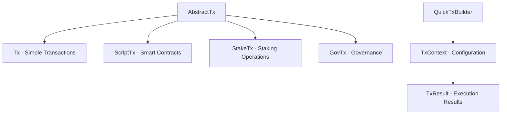

# QuickTx API Reference

QuickTx provides a high-level, fluent API for building Cardano transactions with minimal boilerplate. This comprehensive reference covers all classes, methods, and usage patterns in the QuickTx framework.

## Architecture Overview

The QuickTx API follows a hierarchical builder pattern with clear separation of concerns:



### Key Design Principles

- **Fluent Interface** - Method chaining for readable transaction building
- **Type Safety** - Compile-time verification of transaction components
- **Composability** - Mix multiple transaction types in single operations
- **Flexibility** - Access to underlying low-level APIs when needed
- **Error Handling** - Comprehensive validation and error reporting

## AbstractTx&lt;T&gt; - Base Class

All transaction types inherit from `AbstractTx<T>`, providing common functionality for outputs, metadata, and configuration.

### Core Output Methods

#### Basic Payment Operations

```java
// Single payment with ADA
public T payToAddress(String address, Amount amount)

// Multiple asset payment
public T payToAddress(String address, List<Amount> amounts)

// Payment with native script reference
public T payToAddress(String address, Amount amount, Script script)
public T payToAddress(String address, List<Amount> amounts, Script script)

// Payment with script reference bytes
public T payToAddress(String address, List<Amount> amounts, byte[] scriptRefBytes)
```

**Example Usage:**
```java
Tx tx = new Tx()
    .payToAddress("addr1...", Amount.ada(10))
    .payToAddress("addr2...", Arrays.asList(
        Amount.ada(5),
        Amount.asset("policy.token", 1000)
    ))
    .from(senderAddress);
```

#### Contract Output Methods

```java
// Payment to contract with inline datum
public T payToContract(String address, Amount amount, PlutusData datum)
public T payToContract(String address, List<Amount> amounts, PlutusData datum)

// Payment to contract with datum hash
public T payToContract(String address, Amount amount, String datumHash)
public T payToContract(String address, List<Amount> amounts, String datumHash)

// Payment with reference script
public T payToContract(String address, List<Amount> amounts, PlutusData datum, Script refScript)
public T payToContract(String address, Amount amount, PlutusData datum, Script refScript)
public T payToContract(String address, List<Amount> amounts, PlutusData datum, byte[] scriptRefBytes)
```

**Example Usage:**
```java
// Create datum for contract
PlutusData datum = PlutusData.newBytes("contract_state".getBytes());

ScriptTx scriptTx = new ScriptTx()
    .payToContract("addr1...", Amount.ada(5), datum)
    .from(senderAddress);
```

### Configuration Methods

#### Change Address Management

```java
// Explicit change address
public T withChangeAddress(String changeAddress)
```

The change address is automatically derived if not specified:
- From sender address in `Tx`
- From fee payer in `ScriptTx`
- Must be explicitly set for multi-input scenarios

#### Metadata Attachment

```java
// Attach transaction metadata
public T attachMetadata(Metadata metadata)
```

**Common Metadata Patterns:**
```java
// Simple message metadata
Metadata messageMetadata = MessageMetadata.create()
    .add("Transaction purpose: Payment for services");

// CIP-20 structured metadata
Metadata cip20Metadata = Metadata.builder()
    .put(674, Map.of(
        "msg", Arrays.asList("Payment confirmation", "Invoice #12345")
    ))
    .build();

Tx tx = new Tx()
    .payToAddress(receiver, Amount.ada(100))
    .attachMetadata(messageMetadata)
    .from(sender);
```

#### Conway Era Features

```java
// Treasury donation (Conway era)
public T donateToTreasury(@NonNull BigInteger currentTreasuryValue, @NonNull BigInteger donationAmount)
```

### Abstract Methods (Implementation Required)

Transaction classes must implement these methods:

```java
protected abstract String getChangeAddress()    // Change address resolution
protected abstract String getFromAddress()      // Primary sender address
protected abstract Wallet getFromWallet()       // Sender wallet (if applicable)
protected abstract void postBalanceTx(Transaction transaction)  // Post-balance hooks
protected abstract void verifyData()            // Transaction validation
protected abstract String getFeePayer()         // Fee payer resolution
```

## Tx Class - Simple Transactions

The `Tx` class handles standard payment transactions, native asset operations, and embedded staking/governance operations.

### Sender Configuration

```java
// Address-based sender
public Tx from(String sender)

// HD Wallet-based sender (recommended)
public Tx from(Wallet sender)
```

When using a `Wallet`, change addresses are automatically managed using different derivation indices.

### Input Collection

```java
// Manual UTXO specification
public Tx collectFrom(List<Utxo> utxos)
public Tx collectFrom(Set<Utxo> utxos)
```

**Use Cases:**
- Spending specific UTXOs for consolidation
- Using UTXOs with particular assets or amounts
- Avoiding automatic UTXO selection

**Example:**
```java
// Collect specific UTXOs
List<Utxo> targetUtxos = Arrays.asList(
    Utxo.builder()
        .txHash("abc123...")
        .outputIndex(0)
        .amount(Arrays.asList(Amount.ada(10)))
        .address("addr1...")
        .build()
);

Tx tx = new Tx()
    .collectFrom(targetUtxos)
    .payToAddress(receiver, Amount.ada(8))
    .from(sender);
```

### Native Asset Minting

```java
// Basic minting with native scripts
public Tx mintAssets(@NonNull NativeScript script, Asset asset)
public Tx mintAssets(@NonNull NativeScript script, Asset asset, String receiver)
public Tx mintAssets(@NonNull NativeScript script, List<Asset> assets)
public Tx mintAssets(@NonNull NativeScript script, List<Asset> assets, String receiver)
```

**Minting Examples:**

#### Single Asset Minting
```java
// Create minting policy (2-of-3 multi-sig)
ScriptPubkey key1 = ScriptPubkey.createWithNewKey();
ScriptPubkey key2 = ScriptPubkey.createWithNewKey();
ScriptPubkey key3 = ScriptPubkey.createWithNewKey();

ScriptAtLeast mintingPolicy = new ScriptAtLeast(2)
    .addScript(key1)
    .addScript(key2)
    .addScript(key3);

// Create asset
Asset nftAsset = new Asset("MyNFT", BigInteger.ONE);

Tx tx = new Tx()
    .mintAssets(mintingPolicy, nftAsset, receiverAddress)
    .attachMetadata(createNFTMetadata())
    .from(minterAddress);
```

#### Batch Minting
```java
List<Asset> tokenBatch = Arrays.asList(
    new Asset("Token001", BigInteger.valueOf(1000)),
    new Asset("Token002", BigInteger.valueOf(2000)),
    new Asset("Token003", BigInteger.valueOf(1500))
);

Tx tx = new Tx()
    .mintAssets(mintingPolicy, tokenBatch)
    .from(minterAddress);
```

### Embedded Staking Operations

The `Tx` class includes full staking functionality through delegation to an internal `StakeTx` instance:

#### Stake Address Registration

```java
// Register stake address
public Tx registerStakeAddress(@NonNull String address)
public Tx registerStakeAddress(@NonNull Wallet wallet)
public Tx registerStakeAddress(@NonNull Address address)
```

#### Stake Address Deregistration

```java
// Deregister stake address
public Tx deregisterStakeAddress(@NonNull String address)
public Tx deregisterStakeAddress(@NonNull Address address)
public Tx deregisterStakeAddress(@NonNull Wallet wallet)
public Tx deregisterStakeAddress(@NonNull String address, @NonNull String refundAddr)
```

#### Delegation Operations

```java
// Delegate to stake pool
public Tx delegateTo(@NonNull String address, @NonNull String poolId)
public Tx delegateTo(@NonNull Wallet wallet, @NonNull String poolId)
public Tx delegateTo(@NonNull Address address, @NonNull String poolId)
```

#### Rewards Withdrawal

```java
// Withdraw staking rewards
public Tx withdraw(@NonNull String rewardAddress, @NonNull BigInteger amount)
public Tx withdraw(@NonNull Address rewardAddress, @NonNull BigInteger amount)
public Tx withdraw(@NonNull String rewardAddress, @NonNull BigInteger amount, String receiver)
public Tx withdraw(@NonNull Address rewardAddress, @NonNull BigInteger amount, String receiver)
```

#### Pool Operations

```java
// Pool lifecycle management
public Tx registerPool(@NonNull PoolRegistration poolRegistration)
public Tx updatePool(@NonNull PoolRegistration poolRegistration)
public Tx retirePool(@NonNull String poolId, @NonNull int epoch)
```

**Complete Staking Example:**
```java
// Register stake address and delegate in one transaction
Account account = Account.createFromMnemonic(Networks.mainnet(), mnemonic);
String poolId = "pool1abcd...";

Tx stakingTx = new Tx()
    .registerStakeAddress(account.stakeAddress())
    .delegateTo(account.stakeAddress(), poolId)
    .from(account.baseAddress());

Result<String> result = quickTxBuilder.compose(stakingTx)
    .withSigner(SignerProviders.signerFrom(account))
    .complete();
```

### Embedded Governance Operations

The `Tx` class includes Conway era governance functionality:

#### DRep Operations

```java
// DRep registration
public Tx registerDRep(@NonNull Account account, Anchor anchor)
public Tx registerDRep(@NonNull Account account)
public Tx registerDRep(@NonNull Credential drepCredential, Anchor anchor)
public Tx registerDRep(@NonNull Credential drepCredential)

// DRep deregistration
public Tx unregisterDRep(@NonNull Credential drepCredential, String refundAddress, BigInteger refundAmount)
public Tx unregisterDRep(@NonNull Credential drepCredential)
public Tx unregisterDRep(@NonNull Credential drepCredential, @NonNull String refundAddress)

// DRep updates
public Tx updateDRep(@NonNull Credential drepCredential, Anchor anchor)
public Tx updateDRep(@NonNull Credential drepCredential)
```

#### Proposal and Voting

```java
// Create governance proposals
public Tx createProposal(@NonNull GovAction govAction, @NonNull String rewardAccount, Anchor anchor)

// Submit votes
public Tx createVote(@NonNull Voter voter, @NonNull GovActionId govActionId, @NonNull Vote vote, Anchor anchor)
public Tx createVote(@NonNull Voter voter, @NonNull GovActionId govActionId, @NonNull Vote vote)

// Vote delegation
public Tx delegateVotingPowerTo(@NonNull String address, @NonNull DRep drep)
public Tx delegateVotingPowerTo(@NonNull Address address, @NonNull DRep drep)
```

## ScriptTx Class - Smart Contract Interactions

The `ScriptTx` class provides specialized functionality for Plutus smart contract interactions, including script UTXO spending, reference inputs, and validator attachment.

### Script UTXO Collection

#### With Redeemer and Datum

```java
// Single UTXO with full context
public ScriptTx collectFrom(Utxo utxo, PlutusData redeemerData, PlutusData datum)

// Multiple UTXOs with shared context
public ScriptTx collectFrom(List<Utxo> utxos, PlutusData redeemerData, PlutusData datum)
```

#### With Redeemer Only

```java
// When datum is already at script address
public ScriptTx collectFrom(Utxo utxo, PlutusData redeemerData)
public ScriptTx collectFrom(List<Utxo> utxos, PlutusData redeemerData)
```

#### Balance-Only Collection

```java
// For balance-only spending (no script execution)
public ScriptTx collectFrom(Utxo utxo)
public ScriptTx collectFrom(List<Utxo> utxos)
```

**Script Spending Example:**
```java
// Redeemer for unlocking script
PlutusData unlockRedeemer = PlutusData.newBytes("unlock".getBytes());

// Datum at script address (if not inline)
PlutusData contractState = PlutusData.newMap(Map.of(
    PlutusData.newBytes("owner".getBytes()), 
    PlutusData.newBytes(ownerPubKeyHash)
));

ScriptTx scriptTx = new ScriptTx()
    .collectFrom(scriptUtxo, unlockRedeemer, contractState)
    .payToAddress(ownerAddress, Amount.ada(5))
    .attachSpendingValidator(contractValidator);
```

### Reference Input Management

```java
// Reference inputs for reading data without spending
public ScriptTx readFrom(Utxo... utxos)
public ScriptTx readFrom(TransactionInput... transactionInputs)
public ScriptTx readFrom(String txHash, int outputIndex)
```

**Reference Input Use Cases:**
- Reading oracle data
- Accessing reference scripts
- Reading protocol parameters
- Checking global state

**Example:**
```java
// Read oracle price data
ScriptTx oracleTx = new ScriptTx()
    .readFrom(oracleUtxo)                    // Read price data
    .collectFrom(userUtxo, redeemer)         // Spend user UTXO
    .payToContract(poolAddress, amount, newDatum)  // Update pool
    .attachSpendingValidator(poolValidator);
```

### Plutus Asset Minting

```java
// Basic Plutus script minting
public ScriptTx mintAsset(PlutusScript script, Asset asset, PlutusData redeemer)
public ScriptTx mintAsset(PlutusScript script, List<Asset> assets, PlutusData redeemer)

// With explicit receiver
public ScriptTx mintAsset(PlutusScript script, Asset asset, PlutusData redeemer, String receiver)
public ScriptTx mintAsset(PlutusScript script, List<Asset> assets, PlutusData redeemer, String receiver)

// With output datum
public ScriptTx mintAsset(PlutusScript script, List<Asset> assets, PlutusData redeemer, String receiver, PlutusData outputDatum)
```

**Plutus Minting Example:**
```java
// NFT minting with Plutus script
PlutusScript nftValidator = // ... load validator
PlutusData mintRedeemer = PlutusData.newMap(Map.of(
    PlutusData.newBytes("action".getBytes()), 
    PlutusData.newBytes("mint".getBytes()),
    PlutusData.newBytes("token_name".getBytes()), 
    PlutusData.newBytes("MyNFT".getBytes())
));

Asset nft = new Asset("MyNFT", BigInteger.ONE);

ScriptTx mintTx = new ScriptTx()
    .mintAsset(nftValidator, nft, mintRedeemer, collectorAddress)
    .attachMetadata(nftMetadata);
```

### Validator Attachment

```java
// Attach validators for different purposes
public ScriptTx attachSpendingValidator(PlutusScript plutusScript)
public ScriptTx attachCertificateValidator(PlutusScript plutusScript)
public ScriptTx attachRewardValidator(PlutusScript plutusScript)
public ScriptTx attachProposingValidator(PlutusScript plutusScript)
public ScriptTx attachVotingValidator(PlutusScript plutusScript)
```

Each validator type serves specific purposes:
- **Spending**: For UTXO spending validation
- **Certificate**: For staking certificate validation
- **Reward**: For reward withdrawal validation
- **Proposing**: For governance proposal validation
- **Voting**: For governance voting validation

### Script Change Outputs

```java
// Change with inline datum
public ScriptTx withChangeAddress(String changeAddress, PlutusData plutusData)

// Change with datum hash
public ScriptTx withChangeAddress(String changeAddress, String datumHash)
```

**Use Case:**
When change needs to go back to a script address with specific datum requirements.

### Script-Based Staking Operations

All staking operations from `Tx` are available with redeemer support:

```java
// Staking with script validation
public ScriptTx deregisterStakeAddress(@NonNull String address, PlutusData redeemer)
public ScriptTx delegateTo(@NonNull String address, @NonNull String poolId, PlutusData redeemer)
public ScriptTx withdraw(@NonNull String rewardAddress, @NonNull BigInteger amount, PlutusData redeemer)
```

### Script-Based Governance Operations

All governance operations with script validation support:

```java
// Governance with script validation
public ScriptTx registerDRep(@NonNull Credential drepCredential, Anchor anchor, PlutusData redeemer)
public ScriptTx createVote(@NonNull Voter voter, @NonNull GovActionId govActionId, @NonNull Vote vote, Anchor anchor, PlutusData redeemer)
```

**Complete DApp Interaction Example:**
```java
// DEX swap interaction
PlutusScript dexValidator = // ... load DEX validator
PlutusData swapRedeemer = PlutusData.newMap(Map.of(
    PlutusData.newBytes("action".getBytes()), 
    PlutusData.newBytes("swap".getBytes()),
    PlutusData.newInteger(BigInteger.valueOf(1000)), // amount_in
    PlutusData.newInteger(BigInteger.valueOf(950))   // min_amount_out
));

ScriptTx swapTx = new ScriptTx()
    .collectFrom(dexPoolUtxo, swapRedeemer)          // Spend from pool
    .readFrom(oracleUtxo)                            // Read price data
    .payToContract(dexAddress, newPoolAmount, newPoolDatum)  // Update pool
    .payToAddress(userAddress, swapOutputAmount)     // Send tokens to user
    .attachSpendingValidator(dexValidator)
    .feePayer(userAddress);

Result<String> result = quickTxBuilder.compose(swapTx)
    .withSigner(SignerProviders.signerFrom(userAccount))
    .completeAndWait();
```

## QuickTxBuilder Class - Orchestration

The `QuickTxBuilder` class orchestrates transaction building, signing, and submission. It provides the entry point for composing transactions and configuring execution context.

### Constructor Patterns

```java
// Full manual configuration
public QuickTxBuilder(UtxoSupplier utxoSupplier, 
                      ProtocolParamsSupplier protocolParamsSupplier, 
                      TransactionProcessor transactionProcessor)

// With script supplier
public QuickTxBuilder(UtxoSupplier utxoSupplier,
                      ProtocolParamsSupplier protocolParamsSupplier,
                      ScriptSupplier scriptSupplier,
                      TransactionProcessor transactionProcessor)

// From backend service (recommended)
public QuickTxBuilder(BackendService backendService)

// With custom UTXO supplier
public QuickTxBuilder(BackendService backendService, UtxoSupplier utxoSupplier)
```

**Recommended Usage:**
```java
// Simple setup with Blockfrost
BFBackendService backendService = new BFBackendService(
    "https://cardano-mainnet.blockfrost.io/api/v0/", 
    "your_project_id"
);
QuickTxBuilder quickTxBuilder = new QuickTxBuilder(backendService);

// Advanced setup with custom UTXO supplier
UtxoSupplier customUtxoSupplier = new CachingUtxoSupplier(
    new DefaultUtxoSupplier(backendService.getUtxoService())
);
QuickTxBuilder quickTxBuilder = new QuickTxBuilder(backendService, customUtxoSupplier);
```

### Transaction Composition

```java
// Entry point for all transaction composition
public TxContext compose(AbstractTx... txs)
```

The `compose` method accepts multiple transaction objects and returns a `TxContext` for configuration and execution.

**Multi-Transaction Example:**
```java
// Atomic multi-operation transaction
Tx payment = new Tx()
    .payToAddress(recipient1, Amount.ada(10))
    .from(sender1);

Tx staking = new Tx()
    .registerStakeAddress(stakeAccount)
    .delegateTo(stakeAccount, poolId)
    .from(sender2);

ScriptTx nftMint = new ScriptTx()
    .mintAsset(nftPolicy, nftAsset, mintRedeemer, recipient2)
    .attachMetadata(nftMetadata);

// Compose all operations atomically
Result<String> result = quickTxBuilder.compose(payment, staking, nftMint)
    .feePayer(feePayerAddress)
    .withSigner(SignerProviders.signerFrom(sender1))
    .withSigner(SignerProviders.signerFrom(sender2))
    .withSigner(SignerProviders.signerFrom(feePayer))
    .withSigner(SignerProviders.signerFrom(nftPolicyKey))
    .complete();
```

## TxContext Class - Configuration & Execution

The `TxContext` class provides a fluent API for configuring transaction execution parameters, signing, and submission.

### Core Configuration

#### Fee Management

```java
// Explicit fee payer
public TxContext feePayer(String address)
public TxContext feePayer(Wallet feePayerWallet)
```

**Fee Payer Priority:**
1. Explicitly set fee payer
2. Transaction's primary sender
3. First available sender address

#### Collateral Management

```java
// Collateral for script transactions
public TxContext collateralPayer(String address)
public TxContext collateralPayer(Wallet wallet)

// Manual collateral inputs
public TxContext withCollateralInputs(TransactionInput... inputs)
```

Collateral is automatically managed but can be explicitly controlled for script transactions.

### Transaction Hooks

```java
// Pre-balance transformation
public TxContext preBalanceTx(TxBuilder txBuilder)

// Post-balance transformation
public TxContext postBalanceTx(TxBuilder txBuilder)
```

**Hook Use Cases:**
- Adding custom inputs/outputs
- Modifying fee calculations
- Adding auxiliary data
- Custom validation logic

**Example:**
```java
TxBuilder addCustomOutput = (context, txn) -> {
    // Add developer fee output
    TransactionOutput devFee = TransactionOutput.builder()
        .address("addr1_dev_address...")
        .value(Value.builder().coin(BigInteger.valueOf(500000)).build())
        .build();
    txn.getBody().getOutputs().add(devFee);
};

Result<String> result = quickTxBuilder.compose(tx)
    .postBalanceTx(addCustomOutput)
    .withSigner(signer)
    .complete();
```

### Signing Configuration

#### Primary Signers

```java
// Add transaction signers
public TxContext withSigner(@NonNull TxSigner signer)
```

Signers are cumulative - call multiple times to add multiple signers.

#### Advanced Signing Configuration

```java
// For fee calculation (script transactions)
public TxContext additionalSignersCount(int additionalSigners)

// Required signers for witness requirements
public TxContext withRequiredSigners(Address... addresses)
public TxContext withRequiredSigners(byte[]... credentials)
```

**Complex Signing Example:**
```java
// Multi-signature scenario
TxSigner userSigner = SignerProviders.signerFrom(userAccount);
TxSigner treasurySigner = SignerProviders.signerFrom(treasuryKey);
TxSigner scriptSigner = SignerProviders.signerFrom(scriptKey);

Result<String> result = quickTxBuilder.compose(tx)
    .withSigner(userSigner)
    .withSigner(treasurySigner)
    .withSigner(scriptSigner)
    .withRequiredSigners(userAccount.baseAddress(), treasuryAddress)
    .complete();
```

### Validity Configuration

```java
// Transaction validity window
public TxContext validFrom(long slot)
public TxContext validTo(long slot)
```

**Time-based Transactions:**
```java
// Transaction valid for 2 hours from current slot
long currentSlot = getCurrentSlot();
long validFromSlot = currentSlot + 10;        // Valid from 10 slots from now
long validToSlot = currentSlot + 7200;        // Valid for 2 hours (1 slot = 1 second)

Result<String> result = quickTxBuilder.compose(tx)
    .validFrom(validFromSlot)
    .validTo(validToSlot)
    .withSigner(signer)
    .complete();
```

### Advanced Configuration

#### Output Management

```java
// Merge outputs to same address
public TxContext mergeOutputs(boolean merge)
```

When `true`, outputs to the same address are automatically combined.

#### Script Evaluation

```java
// Custom script evaluation
public TxContext withTxEvaluator(TransactionEvaluator txEvaluator)

// Ignore script cost errors (for testing)
public TxContext ignoreScriptCostEvaluationError(boolean flag)
```

#### Transaction Inspection

```java
// Inspect built transaction before submission
public TxContext withTxInspector(Consumer<Transaction> txInspector)
```

**Inspection Example:**
```java
Consumer<Transaction> inspector = (tx) -> {
    System.out.println("Transaction size: " + tx.serialize().length + " bytes");
    System.out.println("Fee: " + tx.getBody().getFee() + " lovelace");
    System.out.println("Outputs: " + tx.getBody().getOutputs().size());
};

Result<String> result = quickTxBuilder.compose(tx)
    .withTxInspector(inspector)
    .withSigner(signer)
    .complete();
```

#### UTXO Selection

```java
// Custom UTXO selection strategy
public TxContext withUtxoSelectionStrategy(UtxoSelectionStrategy utxoSelectionStrategy)
```

Available strategies:
- `DefaultUtxoSelectionStrategyImpl` - Largest first
- `LargestFirstUtxoSelectionStrategy` - Explicit largest first
- `RandomImproveUtxoSelectionStrategy` - Random with improvement

#### Reference Scripts

```java
// Reference scripts for fee calculation
public TxContext withReferenceScripts(PlutusScript... scripts)
```

Helps with accurate fee calculation for script transactions using reference inputs.

#### Era Configuration

```java
// Serialization era
public TxContext withSerializationEra(Era era)
```

Controls transaction format for different Cardano eras (Alonzo, Babbage, Conway).

### Execution Methods

#### Build Only

```java
// Build transaction without submission
public Transaction build()

// Build and sign locally
public Transaction buildAndSign()
```

**Build-Only Use Cases:**
- Transaction analysis
- Cold wallet signing
- Multi-stage approval processes

#### Submit and Return

```java
// Submit and return immediately
public TxResult complete()
```

Returns immediately after submission with `TxStatus.SUBMITTED` or `TxStatus.FAILED`.

#### Submit and Wait

```java
// Wait for confirmation with default timeout
public TxResult completeAndWait()

// Wait with logging
public TxResult completeAndWait(Consumer<String> logConsumer)

// Wait with custom timeout
public TxResult completeAndWait(Duration timeout)
public TxResult completeAndWait(Duration timeout, Consumer<String> logConsumer)

// Wait with custom timeout and check interval
public TxResult completeAndWait(@NonNull Duration timeout, @NonNull Duration checkInterval, @NonNull Consumer<String> logConsumer)
```

**Wait Configuration:**
- Default timeout: 60 seconds
- Default check interval: 1 second
- Returns `TxStatus.CONFIRMED` on success or `TxStatus.TIMEOUT` on timeout

#### Async Execution

```java
// Async submission and wait
public CompletableFuture<TxResult> completeAndWaitAsync()
public CompletableFuture<TxResult> completeAndWaitAsync(@NonNull Consumer<String> logConsumer)
public CompletableFuture<TxResult> completeAndWaitAsync(@NonNull Consumer<String> logConsumer, @NonNull Executor executor)
public CompletableFuture<TxResult> completeAndWaitAsync(@NonNull Duration checkInterval, @NonNull Consumer<String> logConsumer)
public CompletableFuture<TxResult> completeAndWaitAsync(@NonNull Duration checkInterval, @NonNull Consumer<String> logConsumer, Executor executor)
```

**Async Example:**
```java
CompletableFuture<TxResult> future = quickTxBuilder.compose(tx)
    .withSigner(signer)
    .completeAndWaitAsync(System.out::println);

// Non-blocking operation
future.thenAccept(result -> {
    if (result.isSuccessful()) {
        System.out.println("Transaction confirmed: " + result.getTxHash());
    } else {
        System.err.println("Transaction failed: " + result.getResponse());
    }
});
```

## Result Types

### TxResult Class

```java
public class TxResult extends Result<String> {
    public TxResult withTxStatus(TxStatus status)
    public TxStatus getTxStatus()
    public String getTxHash()  // Alias for getValue()
    public static TxResult fromResult(Result<String> result)
}
```

**Result Handling:**
```java
TxResult result = quickTxBuilder.compose(tx)
    .withSigner(signer)
    .completeAndWait();

if (result.isSuccessful()) {
    String txHash = result.getTxHash();
    TxStatus status = result.getTxStatus();
    System.out.println("Success: " + txHash + " (" + status + ")");
} else {
    System.err.println("Error: " + result.getResponse());
}
```

### TxStatus Enum

```java
public enum TxStatus {
    SUBMITTED,    // Transaction submitted to network
    FAILED,       // Transaction submission failed
    PENDING,      // Transaction pending confirmation
    TIMEOUT,      // Wait timeout exceeded
    CONFIRMED     // Transaction confirmed in block
}
```

## Integration Patterns

### HD Wallet Integration

```java
// Create HD wallet
Wallet wallet = Wallet.createFromMnemonic(Networks.mainnet(), mnemonic);
Account senderAccount = wallet.getAccount(0, 0);
Account changeAccount = wallet.getAccount(0, 1);

// Use in transaction
Tx tx = new Tx()
    .payToAddress(receiver, Amount.ada(50))
    .from(senderAccount.baseAddress())
    .withChangeAddress(changeAccount.baseAddress());

Result<String> result = quickTxBuilder.compose(tx)
    .withSigner(SignerProviders.signerFrom(senderAccount))
    .complete();
```

### Native Script Integration

```java
// Create multi-sig script
ScriptPubkey key1 = ScriptPubkey.createWithNewKey();
ScriptPubkey key2 = ScriptPubkey.createWithNewKey();
ScriptAll multiSig = new ScriptAll()
    .addScript(key1)
    .addScript(key2);

// Use in transaction
Tx tx = new Tx()
    .payToAddress(receiver, Amount.ada(10), multiSig)  // Output with script reference
    .from(sender);

Result<String> result = quickTxBuilder.compose(tx)
    .withSigner(SignerProviders.signerFrom(senderAccount))
    .withSigner(SignerProviders.signerFrom(key1))
    .withSigner(SignerProviders.signerFrom(key2))
    .complete();
```

### Plutus Contract Integration

```java
// Load Plutus contract
String contractHex = "590a4e590a4b0100003..."; // Contract CBOR
PlutusScript contract = PlutusV2Script.of(contractHex);

// Create contract interaction
PlutusData redeemer = PlutusData.newBytes("unlock".getBytes());
PlutusData datum = PlutusData.newInteger(BigInteger.valueOf(42));

ScriptTx scriptTx = new ScriptTx()
    .collectFrom(contractUtxo, redeemer)
    .payToContract(contractAddress, Amount.ada(5), datum)
    .attachSpendingValidator(contract);

Result<String> result = quickTxBuilder.compose(scriptTx)
    .withSigner(SignerProviders.signerFrom(userAccount))
    .completeAndWait();
```

## Error Handling Patterns

### Validation Errors

```java
try {
    Result<String> result = quickTxBuilder.compose(tx)
        .withSigner(signer)
        .complete();
        
    if (!result.isSuccessful()) {
        // Handle transaction errors
        System.err.println("Transaction failed: " + result.getResponse());
    }
} catch (IllegalArgumentException e) {
    // Handle validation errors
    System.err.println("Invalid transaction: " + e.getMessage());
} catch (Exception e) {
    // Handle unexpected errors
    System.err.println("Unexpected error: " + e.getMessage());
}
```

### Script Execution Errors

```java
Result<String> result = quickTxBuilder.compose(scriptTx)
    .ignoreScriptCostEvaluationError(false)  // Strict script validation
    .withSigner(signer)
    .complete();

if (!result.isSuccessful()) {
    String error = result.getResponse();
    
    if (error.contains("ExBudget")) {
        System.err.println("Script execution exceeded budget");
    } else if (error.contains("ValidationFailed")) {
        System.err.println("Script validation failed");
    } else {
        System.err.println("Transaction error: " + error);
    }
}
```

## Performance Considerations

### Batch Operations

```java
// Batch multiple payments efficiently
List<TransactionOutput> outputs = recipients.stream()
    .map(addr -> TransactionOutput.builder()
        .address(addr)
        .value(Value.builder().coin(Amount.ada(1).getValue()).build())
        .build())
    .collect(Collectors.toList());

// Use single transaction instead of multiple
Tx batchTx = new Tx();
for (String recipient : recipients) {
    batchTx.payToAddress(recipient, Amount.ada(1));
}
batchTx.from(sender);
```

### UTXO Selection Optimization

```java
// Use efficient UTXO selection
QuickTxBuilder optimizedBuilder = new QuickTxBuilder(backendService)
    .compose(tx)
    .withUtxoSelectionStrategy(new LargestFirstUtxoSelectionStrategy())
    .withSigner(signer);
```

### Connection Pooling

```java
// Configure backend with connection pooling
BFBackendService backendService = new BFBackendService(
    "https://cardano-mainnet.blockfrost.io/api/v0/", 
    "your_project_id"
);

// Reuse QuickTxBuilder instance
QuickTxBuilder quickTxBuilder = new QuickTxBuilder(backendService);
// Use the same instance for multiple transactions
```

## Next Steps

This API reference provides comprehensive coverage of the QuickTx framework. For practical implementation guidance, see:

- **[Builder Patterns Guide](./builder-patterns.md)** - Advanced composition techniques
- **[Error Handling Guide](./error-handling.md)** - Comprehensive error management
- **[Performance Guide](./performance.md)** - Production optimization techniques
- **[First Transaction Tutorial](../quickstart/first-transaction.md)** - Step-by-step examples

## Resources

- **[QuickTx Examples Repository](https://github.com/bloxbean/cardano-client-examples)** - Complete working examples
- **[JavaDoc API Reference](https://javadoc.io/doc/com.bloxbean.cardano/cardano-client-core/latest/index.html)** - Detailed API documentation
- **[Cardano Developer Portal](https://developers.cardano.org/)** - Cardano development resources

---

**QuickTx provides the recommended approach for transaction building in Cardano Client Lib, offering high-level abstractions while maintaining full access to underlying capabilities when needed.**