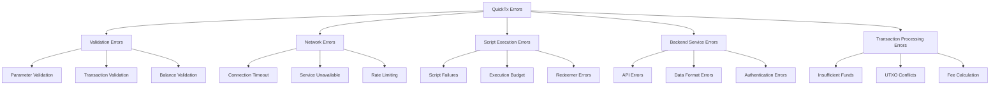

# QuickTx Error Handling & Troubleshooting

Robust error handling is crucial for production Cardano applications. This comprehensive guide covers QuickTx error patterns, common failure scenarios, debugging techniques, and recovery strategies.

## Error Categories Overview

QuickTx errors fall into several categories, each requiring different handling approaches:



## Basic Error Handling Patterns

### Result-Based Error Handling

QuickTx uses the `Result<T>` pattern for error handling:

```java
public class BasicErrorHandling {
    
    public void handleTransactionResult() {
        Tx payment = new Tx()
            .payToAddress(receiverAddress, Amount.ada(10))
            .from(senderAddress);
            
        Result<String> result = quickTxBuilder
            .compose(payment)
            .withSigner(signer)
            .complete();
            
        if (result.isSuccessful()) {
            // Success case
            String txHash = result.getValue();
            System.out.println("Transaction submitted: " + txHash);
            
        } else {
            // Error case
            String errorMessage = result.getResponse();
            System.err.println("Transaction failed: " + errorMessage);
            
            // Handle specific error types
            handleTransactionError(result);
        }
    }
    
    private void handleTransactionError(Result<String> result) {
        String error = result.getResponse();
        
        if (error.contains("InsufficientFunds")) {
            handleInsufficientFunds(error);
        } else if (error.contains("ValidationError")) {
            handleValidationError(error);
        } else if (error.contains("NetworkError")) {
            handleNetworkError(error);
        } else {
            handleGenericError(error);
        }
    }
}
```

### TxResult Enhanced Error Information

`TxResult` provides additional context beyond basic `Result`:

```java
public class EnhancedErrorHandling {
    
    public void handleTxResult() {
        TxResult result = quickTxBuilder
            .compose(transaction)
            .withSigner(signer)
            .completeAndWait();
            
        switch (result.getTxStatus()) {
            case CONFIRMED:
                handleSuccess(result.getTxHash());
                break;
                
            case FAILED:
                handleFailure(result.getResponse());
                break;
                
            case TIMEOUT:
                handleTimeout(result);
                break;
                
            case PENDING:
                handlePending(result.getTxHash());
                break;
                
            default:
                handleUnknownStatus(result);
        }
    }
    
    private void handleSuccess(String txHash) {
        log.info("Transaction confirmed: {}", txHash);
        notifySuccess(txHash);
        updateApplicationState(txHash);
    }
    
    private void handleFailure(String error) {
        log.error("Transaction failed: {}", error);
        
        // Parse error for specific handling
        TransactionError errorType = parseError(error);
        switch (errorType) {
            case INSUFFICIENT_FUNDS:
                suggestFundingOptions();
                break;
            case INVALID_SCRIPT:
                suggestScriptDebugging();
                break;
            case NETWORK_CONGESTION:
                scheduleRetry();
                break;
            default:
                escalateToSupport(error);
        }
    }
    
    private void handleTimeout(TxResult result) {
        log.warn("Transaction timed out, checking status...");
        
        // Check if transaction was actually submitted
        if (result.getTxHash() != null) {
            // Transaction was submitted but didn't confirm in time
            scheduleStatusCheck(result.getTxHash());
        } else {
            // Transaction was never submitted
            retryTransaction();
        }
    }
}
```

## Exception Handling Patterns

### Catching Validation Exceptions

```java
public class ValidationExceptionHandling {
    
    public TxResult executeWithValidation(AbstractTx transaction) {
        try {
            return quickTxBuilder
                .compose(transaction)
                .withSigner(signer)
                .completeAndWait();
                
        } catch (IllegalArgumentException e) {
            // Parameter validation errors
            log.error("Invalid transaction parameters: {}", e.getMessage());
            throw new TransactionValidationException("Invalid parameters", e);
            
        } catch (IllegalStateException e) {
            // State validation errors (e.g., insufficient funds)
            log.error("Invalid transaction state: {}", e.getMessage());
            throw new TransactionStateException("Invalid state", e);
            
        } catch (RuntimeException e) {
            // Unexpected runtime errors
            log.error("Unexpected transaction error: {}", e.getMessage(), e);
            throw new TransactionExecutionException("Unexpected error", e);
        }
    }
}
```

### Network Exception Handling

```java
public class NetworkExceptionHandling {
    
    public TxResult executeWithNetworkHandling(AbstractTx transaction) {
        int maxRetries = 3;
        int retryDelay = 1000; // 1 second
        
        for (int attempt = 1; attempt <= maxRetries; attempt++) {
            try {
                return quickTxBuilder
                    .compose(transaction)
                    .withSigner(signer)
                    .completeAndWait();
                    
            } catch (ConnectException e) {
                handleConnectionError(e, attempt, maxRetries);
                
            } catch (SocketTimeoutException e) {
                handleTimeoutError(e, attempt, maxRetries);
                
            } catch (IOException e) {
                handleIOError(e, attempt, maxRetries);
            }
            
            // Wait before retry
            if (attempt < maxRetries) {
                try {
                    Thread.sleep(retryDelay * attempt); // Exponential backoff
                } catch (InterruptedException ie) {
                    Thread.currentThread().interrupt();
                    throw new TransactionExecutionException("Interrupted during retry", ie);
                }
            }
        }
        
        throw new TransactionExecutionException("Failed after " + maxRetries + " attempts");
    }
    
    private void handleConnectionError(ConnectException e, int attempt, int maxRetries) {
        log.warn("Connection failed (attempt {}/{}): {}", attempt, maxRetries, e.getMessage());
        
        if (attempt == maxRetries) {
            throw new TransactionNetworkException("Unable to connect to backend service", e);
        }
    }
}
```

## Common Error Scenarios

### 1. Insufficient Funds Errors

**Error Pattern:**
```
"InsufficientFunds: Available: 1500000 lovelace, Required: 2000000 lovelace"
```

**Detection and Handling:**
```java
public class InsufficientFundsHandler {
    
    public TxResult handleInsufficientFunds(AbstractTx transaction) {
        try {
            return quickTxBuilder
                .compose(transaction)
                .withSigner(signer)
                .complete();
                
        } catch (Exception e) {
            if (isInsufficientFundsError(e)) {
                return handleFundingShortfall(transaction, e);
            }
            throw e;
        }
    }
    
    private boolean isInsufficientFundsError(Exception e) {
        String message = e.getMessage();
        return message != null && 
               (message.contains("InsufficientFunds") || 
                message.contains("Not enough funds"));
    }
    
    private TxResult handleFundingShortfall(AbstractTx transaction, Exception e) {
        log.warn("Insufficient funds detected: {}", e.getMessage());
        
        // Parse required and available amounts
        FundingInfo funding = parseFundingInfo(e.getMessage());
        BigInteger shortfall = funding.getRequired().subtract(funding.getAvailable());
        
        // Suggest solutions
        suggestFundingSolutions(shortfall);
        
        // Attempt automatic funding if configured
        if (autoFundingEnabled) {
            return attemptAutoFunding(transaction, shortfall);
        }
        
        return TxResult.failure("Insufficient funds: need " + shortfall + " more lovelace");
    }
    
    private TxResult attemptAutoFunding(AbstractTx transaction, BigInteger shortfall) {
        try {
            // Fund from treasury or backup account
            fundAccount(shortfall);
            
            // Retry original transaction
            return quickTxBuilder
                .compose(transaction)
                .withSigner(signer)
                .complete();
                
        } catch (Exception e) {
            log.error("Auto-funding failed: {}", e.getMessage());
            return TxResult.failure("Auto-funding failed: " + e.getMessage());
        }
    }
}
```

### 2. Script Execution Errors

**Error Patterns:**
```
"ScriptFailure: ValidationFailed PlutusV2 ..."
"ExBudgetExceeded: Execution budget exceeded"
"RedeemerMismatch: Invalid redeemer data"
```

**Handling Script Errors:**
```java
public class ScriptErrorHandler {
    
    public TxResult handleScriptTransaction(ScriptTx scriptTx) {
        try {
            return quickTxBuilder
                .compose(scriptTx)
                .withSigner(signer)
                .completeAndWait();
                
        } catch (Exception e) {
            return handleScriptError(scriptTx, e);
        }
    }
    
    private TxResult handleScriptError(ScriptTx scriptTx, Exception e) {
        String error = e.getMessage();
        
        if (error.contains("ValidationFailed")) {
            return handleValidationFailure(scriptTx, error);
        } else if (error.contains("ExBudgetExceeded")) {
            return handleBudgetExceeded(scriptTx, error);
        } else if (error.contains("RedeemerMismatch")) {
            return handleRedeemerError(scriptTx, error);
        } else if (error.contains("DatumMismatch")) {
            return handleDatumError(scriptTx, error);
        } else {
            return TxResult.failure("Script error: " + error);
        }
    }
    
    private TxResult handleValidationFailure(ScriptTx scriptTx, String error) {
        log.error("Script validation failed: {}", error);
        
        // Log script context for debugging
        logScriptContext(scriptTx);
        
        // Suggest debugging steps
        ScriptDebuggingInfo debugInfo = ScriptDebuggingInfo.builder()
            .error(error)
            .suggestion("Check script logic and redeemer data")
            .debuggingSteps(Arrays.asList(
                "Verify contract state matches expectations",
                "Check redeemer format and values",
                "Validate datum structure",
                "Review script execution trace"
            ))
            .build();
            
        return TxResult.failure("Script validation failed")
            .withDebuggingInfo(debugInfo);
    }
    
    private TxResult handleBudgetExceeded(ScriptTx scriptTx, String error) {
        log.error("Execution budget exceeded: {}", error);
        
        // Extract budget information
        ExecutionBudget budget = parseExecutionBudget(error);
        
        // Suggest optimizations
        List<String> optimizations = Arrays.asList(
            "Optimize script logic to reduce computation",
            "Split complex operations into multiple transactions",
            "Use reference scripts to reduce transaction size",
            "Consider alternative algorithm implementations"
        );
        
        return TxResult.failure("Execution budget exceeded")
            .withOptimizations(optimizations);
    }
    
    private void logScriptContext(ScriptTx scriptTx) {
        log.debug("=== Script Context Debug Info ===");
        
        // Log spending contexts
        scriptTx.getSpendingContexts().forEach(ctx -> {
            log.debug("Spending UTXO: {}", ctx.getUtxo().getTxHash());
            log.debug("Redeemer: {}", ctx.getRedeemer());
            if (ctx.getDatum() != null) {
                log.debug("Datum: {}", ctx.getDatum());
            }
        });
        
        // Log minting contexts
        scriptTx.getMintingContexts().forEach(ctx -> {
            log.debug("Minting Policy: {}", ctx.getPolicyId());
            log.debug("Assets: {}", ctx.getAssets());
            log.debug("Redeemer: {}", ctx.getRedeemer());
        });
    }
}
```

### 3. Network and Backend Errors

**Error Patterns:**
```
"Connection timeout"
"Service unavailable"
"Rate limit exceeded"
"Invalid API key"
```

**Network Error Handling:**
```java
public class NetworkErrorHandler {
    
    private final CircuitBreaker circuitBreaker;
    private final RateLimiter rateLimiter;
    
    public TxResult executeWithNetworkResilience(AbstractTx transaction) {
        return circuitBreaker.call(() -> {
            // Rate limiting
            rateLimiter.acquire();
            
            try {
                return quickTxBuilder
                    .compose(transaction)
                    .withSigner(signer)
                    .completeAndWait();
                    
            } catch (HttpException e) {
                return handleHttpError(transaction, e);
            } catch (TimeoutException e) {
                return handleTimeoutError(transaction, e);
            } catch (ConnectException e) {
                return handleConnectionError(transaction, e);
            }
        });
    }
    
    private TxResult handleHttpError(AbstractTx transaction, HttpException e) {
        int statusCode = e.getStatusCode();
        
        switch (statusCode) {
            case 429: // Rate limited
                return handleRateLimit(transaction, e);
            case 503: // Service unavailable
                return handleServiceUnavailable(transaction, e);
            case 401: // Unauthorized
                return handleAuthenticationError(transaction, e);
            case 400: // Bad request
                return handleBadRequest(transaction, e);
            default:
                return TxResult.failure("HTTP error " + statusCode + ": " + e.getMessage());
        }
    }
    
    private TxResult handleRateLimit(AbstractTx transaction, HttpException e) {
        log.warn("Rate limit exceeded, scheduling retry");
        
        // Extract retry-after header if available
        Duration retryAfter = parseRetryAfter(e.getHeaders());
        
        return scheduleRetry(transaction, retryAfter);
    }
    
    private TxResult handleServiceUnavailable(AbstractTx transaction, HttpException e) {
        log.warn("Backend service unavailable");
        
        // Try fallback backend if configured
        if (fallbackBackend != null) {
            log.info("Trying fallback backend");
            return executeWithFallback(transaction);
        }
        
        return TxResult.failure("Service unavailable: " + e.getMessage());
    }
    
    private TxResult executeWithFallback(AbstractTx transaction) {
        QuickTxBuilder fallbackBuilder = new QuickTxBuilder(fallbackBackend);
        
        try {
            return fallbackBuilder
                .compose(transaction)
                .withSigner(signer)
                .completeAndWait();
        } catch (Exception e) {
            log.error("Fallback backend also failed: {}", e.getMessage());
            return TxResult.failure("All backends unavailable");
        }
    }
}
```

### 4. Transaction Building Errors

**Building Phase Errors:**
```java
public class TransactionBuildingErrorHandler {
    
    public TxResult buildWithValidation(AbstractTx transaction) {
        try {
            // Pre-build validation
            validateTransactionInputs(transaction);
            
            Transaction builtTx = quickTxBuilder
                .compose(transaction)
                .withSigner(signer)
                .build();
                
            // Post-build validation
            validateBuiltTransaction(builtTx);
            
            // Submit validated transaction
            return submitTransaction(builtTx);
            
        } catch (TransactionBuildException e) {
            return handleBuildError(transaction, e);
        } catch (ValidationException e) {
            return handleValidationError(transaction, e);
        }
    }
    
    private void validateTransactionInputs(AbstractTx transaction) {
        // Validate sender addresses
        if (transaction.getFromAddress() == null) {
            throw new ValidationException("Sender address is required");
        }
        
        // Validate output amounts
        transaction.getOutputs().forEach(output -> {
            if (output.getAmount().getValue().compareTo(BigInteger.ZERO) <= 0) {
                throw new ValidationException("Output amount must be positive");
            }
        });
        
        // Validate metadata size
        if (transaction.getMetadata() != null) {
            byte[] metadataBytes = transaction.getMetadata().serialize();
            if (metadataBytes.length > MAX_METADATA_SIZE) {
                throw new ValidationException("Metadata too large: " + metadataBytes.length + " bytes");
            }
        }
    }
    
    private void validateBuiltTransaction(Transaction transaction) {
        TransactionBody body = transaction.getBody();
        
        // Validate transaction size
        byte[] txBytes = transaction.serialize();
        if (txBytes.length > MAX_TRANSACTION_SIZE) {
            throw new ValidationException("Transaction too large: " + txBytes.length + " bytes");
        }
        
        // Validate fee
        BigInteger fee = body.getFee();
        if (fee.compareTo(MIN_FEE) < 0) {
            throw new ValidationException("Fee too low: " + fee);
        }
        if (fee.compareTo(MAX_FEE) > 0) {
            throw new ValidationException("Fee too high: " + fee);
        }
        
        // Validate output count
        if (body.getOutputs().size() > MAX_OUTPUTS) {
            throw new ValidationException("Too many outputs: " + body.getOutputs().size());
        }
        
        // Validate each output
        body.getOutputs().forEach(this::validateOutput);
    }
    
    private void validateOutput(TransactionOutput output) {
        // Validate address format
        if (!isValidAddress(output.getAddress())) {
            throw new ValidationException("Invalid output address: " + output.getAddress());
        }
        
        // Validate minimum ADA
        BigInteger ada = output.getValue().getCoin();
        BigInteger minAda = calculateMinAda(output);
        if (ada.compareTo(minAda) < 0) {
            throw new ValidationException("Output below minimum ADA: " + ada + " < " + minAda);
        }
    }
}
```

## Error Recovery Strategies

### 1. Automatic Retry with Exponential Backoff

```java
public class RetryableTransactionExecutor {
    
    public TxResult executeWithRetry(AbstractTx transaction, RetryConfig config) {
        int attempt = 1;
        Exception lastException = null;
        
        while (attempt <= config.getMaxAttempts()) {
            try {
                TxResult result = quickTxBuilder
                    .compose(transaction)
                    .withSigner(signer)
                    .completeAndWait();
                    
                if (result.isSuccessful() || !isRetryableError(result)) {
                    return result;
                }
                
                lastException = new TransactionException(result.getResponse());
                
            } catch (Exception e) {
                lastException = e;
                
                if (!isRetryableException(e)) {
                    throw new TransactionExecutionException("Non-retryable error", e);
                }
            }
            
            if (attempt < config.getMaxAttempts()) {
                long delayMs = calculateBackoffDelay(attempt, config);
                log.warn("Transaction attempt {} failed, retrying in {}ms: {}", 
                         attempt, delayMs, lastException.getMessage());
                         
                try {
                    Thread.sleep(delayMs);
                } catch (InterruptedException ie) {
                    Thread.currentThread().interrupt();
                    throw new TransactionExecutionException("Interrupted during retry", ie);
                }
            }
            
            attempt++;
        }
        
        throw new TransactionExecutionException(
            "Transaction failed after " + config.getMaxAttempts() + " attempts", 
            lastException
        );
    }
    
    private boolean isRetryableError(TxResult result) {
        String error = result.getResponse();
        return error.contains("NetworkError") ||
               error.contains("ServiceUnavailable") ||
               error.contains("Timeout") ||
               error.contains("RateLimited");
    }
    
    private boolean isRetryableException(Exception e) {
        return e instanceof ConnectException ||
               e instanceof SocketTimeoutException ||
               e instanceof HttpException;
    }
    
    private long calculateBackoffDelay(int attempt, RetryConfig config) {
        long baseDelay = config.getBaseDelayMs();
        double multiplier = config.getBackoffMultiplier();
        long maxDelay = config.getMaxDelayMs();
        
        long delay = (long) (baseDelay * Math.pow(multiplier, attempt - 1));
        return Math.min(delay, maxDelay);
    }
}
```

### 2. Transaction State Recovery

```java
public class TransactionStateRecovery {
    
    public TxResult recoverTransaction(String txHash) {
        try {
            // Check current transaction status
            TransactionStatus status = backendService.getTransactionStatus(txHash);
            
            switch (status.getState()) {
                case CONFIRMED:
                    log.info("Transaction {} already confirmed", txHash);
                    return TxResult.success(txHash).withTxStatus(TxStatus.CONFIRMED);
                    
                case PENDING:
                    log.info("Transaction {} still pending", txHash);
                    return waitForConfirmation(txHash);
                    
                case FAILED:
                    log.warn("Transaction {} failed: {}", txHash, status.getError());
                    return TxResult.failure(status.getError());
                    
                case NOT_FOUND:
                    log.warn("Transaction {} not found, may need resubmission", txHash);
                    return TxResult.failure("Transaction not found");
                    
                default:
                    log.error("Unknown transaction status: {}", status.getState());
                    return TxResult.failure("Unknown status");
            }
            
        } catch (Exception e) {
            log.error("Error recovering transaction {}: {}", txHash, e.getMessage());
            return TxResult.failure("Recovery failed: " + e.getMessage());
        }
    }
    
    private TxResult waitForConfirmation(String txHash) {
        int maxChecks = 60; // 5 minutes with 5-second intervals
        int checkInterval = 5000; // 5 seconds
        
        for (int check = 0; check < maxChecks; check++) {
            try {
                Thread.sleep(checkInterval);
                
                TransactionStatus status = backendService.getTransactionStatus(txHash);
                
                if (status.getState() == TransactionState.CONFIRMED) {
                    return TxResult.success(txHash).withTxStatus(TxStatus.CONFIRMED);
                } else if (status.getState() == TransactionState.FAILED) {
                    return TxResult.failure(status.getError());
                }
                
                log.debug("Transaction {} still pending, check {}/{}", txHash, check + 1, maxChecks);
                
            } catch (InterruptedException e) {
                Thread.currentThread().interrupt();
                return TxResult.failure("Interrupted while waiting");
            } catch (Exception e) {
                log.warn("Error checking transaction status: {}", e.getMessage());
            }
        }
        
        return TxResult.failure("Timeout waiting for confirmation")
            .withTxStatus(TxStatus.TIMEOUT);
    }
}
```

## Debugging Techniques

### 1. Transaction Inspection

```java
public class TransactionDebugger {
    
    public void debugTransaction(AbstractTx transaction) {
        Consumer<Transaction> debugInspector = tx -> {
            log.debug("=== Transaction Debug Information ===");
            
            debugTransactionStructure(tx);
            debugFeeCalculation(tx);
            debugInputsAndOutputs(tx);
            debugScripts(tx);
            debugMetadata(tx);
        };
        
        try {
            quickTxBuilder
                .compose(transaction)
                .withTxInspector(debugInspector)
                .withSigner(signer)
                .build(); // Build only for debugging
                
        } catch (Exception e) {
            log.error("Debug build failed: {}", e.getMessage(), e);
            debugTransactionInputs(transaction);
        }
    }
    
    private void debugTransactionStructure(Transaction tx) {
        TransactionBody body = tx.getBody();
        
        log.debug("Transaction Structure:");
        log.debug("  Inputs: {}", body.getInputs().size());
        log.debug("  Outputs: {}", body.getOutputs().size());
        log.debug("  Fee: {} ADA", adaFromLovelace(body.getFee()));
        log.debug("  Size: {} bytes", tx.serialize().length);
        
        if (body.getValidityIntervalStart() != null) {
            log.debug("  Valid from: slot {}", body.getValidityIntervalStart());
        }
        
        if (body.getTtl() != null) {
            log.debug("  Valid until: slot {}", body.getTtl());
        }
        
        if (body.getCertificates() != null && !body.getCertificates().isEmpty()) {
            log.debug("  Certificates: {}", body.getCertificates().size());
        }
        
        if (body.getWithdrawals() != null && !body.getWithdrawals().isEmpty()) {
            log.debug("  Withdrawals: {}", body.getWithdrawals().size());
        }
    }
    
    private void debugInputsAndOutputs(Transaction tx) {
        TransactionBody body = tx.getBody();
        
        log.debug("Inputs:");
        body.getInputs().forEach(input -> {
            log.debug("  {} #{}", input.getTransactionId(), input.getIndex());
        });
        
        log.debug("Outputs:");
        for (int i = 0; i < body.getOutputs().size(); i++) {
            TransactionOutput output = body.getOutputs().get(i);
            log.debug("  Output {}: {} to {}", 
                i, 
                formatValue(output.getValue()), 
                truncateAddress(output.getAddress())
            );
            
            if (output.getDatumHash() != null) {
                log.debug("    Datum hash: {}", output.getDatumHash());
            }
            
            if (output.getInlineDatum() != null) {
                log.debug("    Inline datum: {} bytes", output.getInlineDatum().getData().length);
            }
        }
    }
    
    private void debugScripts(Transaction tx) {
        TransactionWitnessSet witnessSet = tx.getWitnessSet();
        
        if (witnessSet != null) {
            if (witnessSet.getPlutusV1Scripts() != null) {
                log.debug("Plutus V1 Scripts: {}", witnessSet.getPlutusV1Scripts().size());
            }
            
            if (witnessSet.getPlutusV2Scripts() != null) {
                log.debug("Plutus V2 Scripts: {}", witnessSet.getPlutusV2Scripts().size());
            }
            
            if (witnessSet.getPlutusV3Scripts() != null) {
                log.debug("Plutus V3 Scripts: {}", witnessSet.getPlutusV3Scripts().size());
            }
            
            if (witnessSet.getRedeemers() != null) {
                log.debug("Redeemers: {}", witnessSet.getRedeemers().size());
                witnessSet.getRedeemers().forEach(redeemer -> {
                    log.debug("  Redeemer: tag={}, index={}, ex_units={}",
                        redeemer.getTag(),
                        redeemer.getIndex(),
                        redeemer.getExUnits()
                    );
                });
            }
        }
    }
}
```

### 2. Script Debugging

```java
public class ScriptDebugger {
    
    public void debugScriptExecution(ScriptTx scriptTx) {
        try {
            Transaction tx = quickTxBuilder
                .compose(scriptTx)
                .ignoreScriptCostEvaluationError(true) // Enable for debugging
                .withTxEvaluator(createDebuggingEvaluator())
                .build();
                
            log.info("Script execution successful");
            
        } catch (Exception e) {
            log.error("Script execution failed: {}", e.getMessage());
            debugScriptFailure(scriptTx, e);
        }
    }
    
    private TransactionEvaluator createDebuggingEvaluator() {
        return new TransactionEvaluator() {
            @Override
            public EvaluationResult evaluate(Transaction tx, Set<Utxo> inputUtxos) {
                log.debug("=== Script Evaluation Debug ===");
                
                // Log script context
                logScriptContext(tx, inputUtxos);
                
                // Perform evaluation
                EvaluationResult result = defaultEvaluator.evaluate(tx, inputUtxos);
                
                // Log evaluation result
                logEvaluationResult(result);
                
                return result;
            }
        };
    }
    
    private void debugScriptFailure(ScriptTx scriptTx, Exception e) {
        log.debug("=== Script Failure Analysis ===");
        
        // Analyze spending contexts
        scriptTx.getSpendingContexts().forEach(ctx -> {
            log.debug("Spending Context:");
            log.debug("  UTXO: {}#{}", ctx.getUtxo().getTxHash(), ctx.getUtxo().getOutputIndex());
            log.debug("  Value: {}", formatValue(ctx.getUtxo().getAmount()));
            
            if (ctx.getRedeemer() != null) {
                log.debug("  Redeemer: {}", ctx.getRedeemer().getData());
            }
            
            if (ctx.getDatum() != null) {
                log.debug("  Datum: {}", ctx.getDatum());
            }
        });
        
        // Analyze minting contexts
        scriptTx.getMintingContexts().forEach(ctx -> {
            log.debug("Minting Context:");
            log.debug("  Policy ID: {}", ctx.getPolicyId());
            log.debug("  Assets: {}", ctx.getAssets());
            log.debug("  Redeemer: {}", ctx.getRedeemer().getData());
        });
        
        // Suggest fixes
        suggestScriptFixes(e);
    }
    
    private void suggestScriptFixes(Exception e) {
        String error = e.getMessage();
        
        List<String> suggestions = new ArrayList<>();
        
        if (error.contains("ValidationFailed")) {
            suggestions.add("Check script logic and validation conditions");
            suggestions.add("Verify redeemer data format and values");
            suggestions.add("Ensure datum matches expected format");
        }
        
        if (error.contains("ExBudgetExceeded")) {
            suggestions.add("Optimize script computation");
            suggestions.add("Reduce redeemer or datum size");
            suggestions.add("Split complex operations");
        }
        
        if (error.contains("MissingRedeemer")) {
            suggestions.add("Ensure redeemer is provided for all script inputs");
            suggestions.add("Check redeemer tag and index");
        }
        
        log.debug("Suggested fixes:");
        suggestions.forEach(suggestion -> log.debug("  - {}", suggestion));
    }
}
```

## Production Error Monitoring

### 1. Error Metrics and Alerting

```java
public class ErrorMonitoringService {
    private final MeterRegistry meterRegistry;
    private final AlertingService alerting;
    
    public TxResult executeWithMonitoring(AbstractTx transaction) {
        Timer.Sample sample = Timer.start(meterRegistry);
        
        try {
            TxResult result = quickTxBuilder
                .compose(transaction)
                .withSigner(signer)
                .completeAndWait();
                
            recordMetrics(result);
            
            if (!result.isSuccessful()) {
                handleErrorAlert(result);
            }
            
            return result;
            
        } catch (Exception e) {
            recordException(e);
            handleExceptionAlert(e);
            throw e;
            
        } finally {
            sample.stop(Timer.builder("transaction.duration")
                .register(meterRegistry));
        }
    }
    
    private void recordMetrics(TxResult result) {
        Counter.builder("transaction.total")
            .tag("status", result.isSuccessful() ? "success" : "failure")
            .tag("tx_status", result.getTxStatus().toString())
            .register(meterRegistry)
            .increment();
            
        if (!result.isSuccessful()) {
            String errorType = classifyError(result.getResponse());
            Counter.builder("transaction.errors")
                .tag("error_type", errorType)
                .register(meterRegistry)
                .increment();
        }
    }
    
    private void handleErrorAlert(TxResult result) {
        String errorType = classifyError(result.getResponse());
        
        if (isHighSeverityError(errorType)) {
            alerting.sendAlert(Alert.builder()
                .severity(AlertSeverity.HIGH)
                .title("High Severity Transaction Error")
                .description("Error: " + result.getResponse())
                .tags(Map.of("error_type", errorType))
                .build());
        }
    }
    
    private String classifyError(String error) {
        if (error.contains("InsufficientFunds")) return "insufficient_funds";
        if (error.contains("ScriptFailure")) return "script_failure";
        if (error.contains("NetworkError")) return "network_error";
        if (error.contains("ValidationError")) return "validation_error";
        return "unknown";
    }
}
```

### 2. Error Logging and Correlation

```java
public class StructuredErrorLogging {
    
    public TxResult executeWithStructuredLogging(AbstractTx transaction, String correlationId) {
        MDC.put("correlation_id", correlationId);
        MDC.put("transaction_type", transaction.getClass().getSimpleName());
        
        try {
            log.info("Starting transaction execution");
            
            TxResult result = quickTxBuilder
                .compose(transaction)
                .withSigner(signer)
                .completeAndWait();
                
            if (result.isSuccessful()) {
                log.info("Transaction successful", 
                    kv("tx_hash", result.getTxHash()),
                    kv("status", result.getTxStatus())
                );
            } else {
                log.error("Transaction failed",
                    kv("error", result.getResponse()),
                    kv("status", result.getTxStatus())
                );
            }
            
            return result;
            
        } catch (Exception e) {
            log.error("Transaction execution exception",
                kv("exception_type", e.getClass().getSimpleName()),
                kv("exception_message", e.getMessage()),
                e
            );
            throw e;
            
        } finally {
            MDC.clear();
        }
    }
}
```

## Error Prevention Strategies

### 1. Pre-Transaction Validation

```java
public class PreTransactionValidator {
    
    public ValidationResult validateBeforeExecution(AbstractTx transaction) {
        List<ValidationError> errors = new ArrayList<>();
        
        // Validate basic structure
        errors.addAll(validateBasicStructure(transaction));
        
        // Validate business rules
        errors.addAll(validateBusinessRules(transaction));
        
        // Validate against current blockchain state
        errors.addAll(validateBlockchainState(transaction));
        
        return errors.isEmpty() ? 
            ValidationResult.success() : 
            ValidationResult.failure(errors);
    }
    
    private List<ValidationError> validateBasicStructure(AbstractTx transaction) {
        List<ValidationError> errors = new ArrayList<>();
        
        if (transaction.getFromAddress() == null) {
            errors.add(ValidationError.of("MISSING_SENDER", "Sender address is required"));
        }
        
        if (transaction.getOutputs().isEmpty()) {
            errors.add(ValidationError.of("NO_OUTPUTS", "At least one output is required"));
        }
        
        transaction.getOutputs().forEach(output -> {
            if (output.getAmount().getValue().compareTo(BigInteger.ZERO) <= 0) {
                errors.add(ValidationError.of("INVALID_AMOUNT", "Output amount must be positive"));
            }
        });
        
        return errors;
    }
    
    private List<ValidationError> validateBlockchainState(AbstractTx transaction) {
        List<ValidationError> errors = new ArrayList<>();
        
        try {
            // Check sender balance
            Value senderBalance = backendService.getAddressValue(transaction.getFromAddress());
            Value requiredValue = calculateRequiredValue(transaction);
            
            if (!hasEnoughFunds(senderBalance, requiredValue)) {
                errors.add(ValidationError.of("INSUFFICIENT_FUNDS", 
                    "Insufficient funds: need " + requiredValue + ", have " + senderBalance));
            }
            
            // Validate UTXOs exist and are unspent
            transaction.getInputs().forEach(input -> {
                if (!isUtxoUnspent(input)) {
                    errors.add(ValidationError.of("UTXO_SPENT", 
                        "UTXO already spent: " + input));
                }
            });
            
        } catch (Exception e) {
            errors.add(ValidationError.of("VALIDATION_ERROR", 
                "Error validating blockchain state: " + e.getMessage()));
        }
        
        return errors;
    }
}
```

## Summary and Best Practices

### Error Handling Checklist

- ✅ **Always check Result objects** - Never ignore transaction results
- ✅ **Use structured logging** - Include correlation IDs and context
- ✅ **Implement retry logic** - For network and temporary errors
- ✅ **Monitor error metrics** - Track error rates and types
- ✅ **Validate before execution** - Catch errors early
- ✅ **Provide meaningful error messages** - Help users understand and fix issues
- ✅ **Use circuit breakers** - Prevent cascade failures
- ✅ **Test error scenarios** - Include error cases in tests

### Common Antipatterns to Avoid

- ❌ **Ignoring error results** - Always handle error cases
- ❌ **Generic error handling** - Don't catch and ignore all exceptions
- ❌ **No error context** - Provide enough information for debugging
- ❌ **Infinite retries** - Always have retry limits
- ❌ **Silent failures** - Log and report all errors
- ❌ **No error classification** - Different errors need different handling

## Next Steps

For production deployments, also review:

- **[Performance Guide](./performance.md)** - Optimization and monitoring
- **[API Reference](./api-reference.md)** - Complete method documentation
- **[Builder Patterns](./builder-patterns.md)** - Advanced composition techniques

## Resources

- **[Error Handling Examples](https://github.com/bloxbean/cardano-client-examples)** - Complete error handling examples
- **[Cardano Error Codes](https://developers.cardano.org/docs/get-started/errors/)** - Official Cardano error documentation
- **[Resilience Patterns](https://resilience4j.readme.io/)** - Circuit breakers and retry patterns

---

**Robust error handling is essential for production Cardano applications. QuickTx provides comprehensive error information and patterns to build resilient transaction processing systems.**