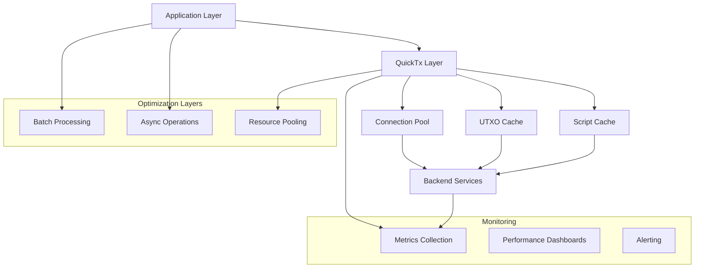

# QuickTx Performance & Production Guide

Building production-ready Cardano applications requires careful attention to performance, scalability, and operational considerations. This guide covers optimization techniques, monitoring strategies, and best practices for deploying QuickTx in production environments.

## Performance Architecture Overview



## Core Performance Optimizations

### 1. Backend Service Configuration

**Optimized Backend Setup:**
```java
public class OptimizedBackendConfiguration {
    
    public BackendService createOptimizedBackend() {
        // Connection pooling configuration
        PoolingHttpClientConnectionManager connectionManager = 
            new PoolingHttpClientConnectionManager();
        connectionManager.setMaxTotal(100);           // Total connections
        connectionManager.setDefaultMaxPerRoute(20);  // Per-route connections
        connectionManager.setValidateAfterInactivity(30000); // 30 seconds
        
        // Request timeout configuration
        RequestConfig requestConfig = RequestConfig.custom()
            .setConnectionRequestTimeout(5000)    // 5 seconds to get connection
            .setConnectTimeout(10000)            // 10 seconds to connect
            .setSocketTimeout(30000)             // 30 seconds for response
            .build();
            
        // HTTP client with optimizations
        CloseableHttpClient httpClient = HttpClientBuilder.create()
            .setConnectionManager(connectionManager)
            .setDefaultRequestConfig(requestConfig)
            .setRetryHandler(new DefaultHttpRequestRetryHandler(3, true))
            .build();
            
        // Configure backend service
        BFBackendService backendService = new BFBackendService(
            "https://cardano-mainnet.blockfrost.io/api/v0/",
            projectId,
            httpClient
        );
        
        return backendService;
    }
}
```

**Connection Pool Monitoring:**
```java
public class ConnectionPoolMonitor {
    private final PoolingHttpClientConnectionManager connectionManager;
    private final MeterRegistry meterRegistry;
    
    public ConnectionPoolMonitor(PoolingHttpClientConnectionManager cm, MeterRegistry registry) {
        this.connectionManager = cm;
        this.meterRegistry = registry;
        
        setupMetrics();
    }
    
    private void setupMetrics() {
        Gauge.builder("http.connections.total")
            .register(meterRegistry, () -> connectionManager.getTotalStats().getMax());
            
        Gauge.builder("http.connections.available")
            .register(meterRegistry, () -> connectionManager.getTotalStats().getAvailable());
            
        Gauge.builder("http.connections.leased")
            .register(meterRegistry, () -> connectionManager.getTotalStats().getLeased());
            
        Gauge.builder("http.connections.pending")
            .register(meterRegistry, () -> connectionManager.getTotalStats().getPending());
    }
}
```

### 2. UTXO Caching and Selection Optimization

**Advanced UTXO Caching:**
```java
public class CachingUtxoSupplier implements UtxoSupplier {
    private final UtxoSupplier delegate;
    private final LoadingCache<String, List<Utxo>> utxoCache;
    private final LoadingCache<String, Value> balanceCache;
    
    public CachingUtxoSupplier(UtxoSupplier delegate) {
        this.delegate = delegate;
        
        this.utxoCache = CacheBuilder.newBuilder()
            .maximumSize(10000)
            .expireAfterWrite(30, TimeUnit.SECONDS)  // 30-second cache
            .recordStats()
            .build(CacheLoader.from(this::loadUtxos));
            
        this.balanceCache = CacheBuilder.newBuilder()
            .maximumSize(50000)
            .expireAfterWrite(10, TimeUnit.SECONDS)  // 10-second balance cache
            .recordStats()
            .build(CacheLoader.from(this::loadBalance));
    }
    
    @Override
    public List<Utxo> getUtxos(String address) {
        try {
            return utxoCache.get(address);
        } catch (ExecutionException e) {
            log.warn("UTXO cache miss for address: {}", address);
            return delegate.getUtxos(address);
        }
    }
    
    @Override
    public Optional<Utxo> getTxOutput(String txHash, int outputIndex) {
        // Check cache first for recent transactions
        String cacheKey = txHash + ":" + outputIndex;
        
        return delegate.getTxOutput(txHash, outputIndex);
    }
    
    private List<Utxo> loadUtxos(String address) {
        return delegate.getUtxos(address);
    }
    
    private Value loadBalance(String address) {
        List<Utxo> utxos = getUtxos(address);
        return utxos.stream()
            .map(Utxo::getAmount)
            .reduce(Value.builder().build(), Value::plus);
    }
    
    public CacheStats getUtxoCacheStats() {
        return utxoCache.stats();
    }
    
    public CacheStats getBalanceCacheStats() {
        return balanceCache.stats();
    }
}
```

**Smart UTXO Selection Strategy:**
```java
public class OptimizedUtxoSelectionStrategy implements UtxoSelectionStrategy {
    private final UtxoSelectionStrategy fallbackStrategy;
    
    public OptimizedUtxoSelectionStrategy() {
        this.fallbackStrategy = new DefaultUtxoSelectionStrategyImpl();
    }
    
    @Override
    public Set<Utxo> selectUtxos(String address, Set<Utxo> availableUtxos, 
                                 Value requiredValue, String datumHash) {
        
        // Fast path for simple ADA-only transactions
        if (isSimpleAdaTransaction(requiredValue)) {
            return selectUtxosForAda(availableUtxos, requiredValue.getCoin());
        }
        
        // Optimized path for native tokens
        if (hasNativeTokens(requiredValue)) {
            return selectUtxosForTokens(availableUtxos, requiredValue);
        }
        
        // Fallback to default strategy
        return fallbackStrategy.selectUtxos(address, availableUtxos, requiredValue, datumHash);
    }
    
    private Set<Utxo> selectUtxosForAda(Set<Utxo> utxos, BigInteger requiredAda) {
        // Sort by ADA amount descending for efficient selection
        List<Utxo> sortedUtxos = utxos.stream()
            .filter(utxo -> hasOnlyAda(utxo))
            .sorted((u1, u2) -> u2.getAmount().get(0).getValue()
                .compareTo(u1.getAmount().get(0).getValue()))
            .collect(Collectors.toList());
            
        Set<Utxo> selected = new HashSet<>();
        BigInteger totalSelected = BigInteger.ZERO;
        
        for (Utxo utxo : sortedUtxos) {
            selected.add(utxo);
            totalSelected = totalSelected.add(utxo.getAmount().get(0).getValue());
            
            if (totalSelected.compareTo(requiredAda) >= 0) {
                break;
            }
        }
        
        return selected;
    }
    
    private Set<Utxo> selectUtxosForTokens(Set<Utxo> utxos, Value requiredValue) {
        // Group UTXOs by asset type for efficient selection
        Map<String, List<Utxo>> utxosByAsset = utxos.stream()
            .collect(Collectors.groupingBy(this::getPrimaryAssetId));
            
        Set<Utxo> selected = new HashSet<>();
        Value remaining = requiredValue;
        
        // Select UTXOs that contain required tokens
        for (MultiAsset requiredAsset : requiredValue.getMultiAssets()) {
            String policyId = requiredAsset.getPolicyId();
            List<Utxo> candidateUtxos = utxosByAsset.getOrDefault(policyId, Collections.emptyList());
            
            selected.addAll(selectForPolicy(candidateUtxos, requiredAsset));
        }
        
        // Add ADA if needed
        BigInteger requiredAda = requiredValue.getCoin();
        BigInteger selectedAda = calculateSelectedAda(selected);
        
        if (selectedAda.compareTo(requiredAda) < 0) {
            BigInteger additionalAda = requiredAda.subtract(selectedAda);
            selected.addAll(selectUtxosForAda(utxos, additionalAda));
        }
        
        return selected;
    }
}
```

### 3. Transaction Batching and Optimization

**Batch Transaction Processing:**
```java
public class BatchTransactionProcessor {
    private final QuickTxBuilder quickTxBuilder;
    private final int maxBatchSize;
    private final Duration batchTimeout;
    
    public BatchTransactionProcessor(QuickTxBuilder builder) {
        this.quickTxBuilder = builder;
        this.maxBatchSize = 10;
        this.batchTimeout = Duration.ofSeconds(5);
    }
    
    public CompletableFuture<List<TxResult>> processBatch(List<TransactionRequest> requests) {
        // Group by sender for optimization
        Map<String, List<TransactionRequest>> bySender = requests.stream()
            .collect(Collectors.groupingBy(TransactionRequest::getSender));
            
        List<CompletableFuture<TxResult>> futures = bySender.entrySet().stream()
            .map(entry -> processSenderBatch(entry.getKey(), entry.getValue()))
            .collect(Collectors.toList());
            
        return CompletableFuture.allOf(futures.toArray(new CompletableFuture[0]))
            .thenApply(v -> futures.stream()
                .map(CompletableFuture::join)
                .collect(Collectors.toList()));
    }
    
    private CompletableFuture<TxResult> processSenderBatch(String sender, List<TransactionRequest> requests) {
        // Create single transaction with multiple outputs
        Tx batchTx = new Tx().from(sender);
        
        for (TransactionRequest request : requests) {
            batchTx.payToAddress(request.getReceiver(), request.getAmount());
        }
        
        // Add batch metadata
        Metadata batchMetadata = createBatchMetadata(requests);
        batchTx.attachMetadata(batchMetadata);
        
        return quickTxBuilder
            .compose(batchTx)
            .mergeOutputs(true)  // Optimize duplicate addresses
            .withSigner(getSigner(sender))
            .completeAndWaitAsync();
    }
    
    private Metadata createBatchMetadata(List<TransactionRequest> requests) {
        Map<String, Object> batchInfo = Map.of(
            "batch_size", requests.size(),
            "batch_timestamp", Instant.now().getEpochSecond(),
            "request_ids", requests.stream()
                .map(TransactionRequest::getId)
                .collect(Collectors.toList())
        );
        
        return Metadata.builder()
            .put(674, Map.of("batch_info", batchInfo))
            .build();
    }
}
```

**Output Consolidation:**
```java
public class OutputConsolidationService {
    
    public TxResult consolidateUtxos(String address, ConsolidationConfig config) {
        // Get all UTXOs for address
        List<Utxo> utxos = backendService.getUtxos(address);
        
        if (utxos.size() < config.getMinUtxosToConsolidate()) {
            return TxResult.success("No consolidation needed");
        }
        
        // Group small UTXOs for consolidation
        List<Utxo> smallUtxos = utxos.stream()
            .filter(utxo -> isSmallUtxo(utxo, config.getSmallUtxoThreshold()))
            .limit(config.getMaxInputsPerTx())
            .collect(Collectors.toList());
            
        if (smallUtxos.isEmpty()) {
            return TxResult.success("No small UTXOs to consolidate");
        }
        
        // Create consolidation transaction
        Tx consolidationTx = new Tx()
            .collectFrom(smallUtxos)
            .payToAddress(address, calculateTotalValue(smallUtxos))
            .from(address);
            
        return quickTxBuilder
            .compose(consolidationTx)
            .withSigner(getSigner(address))
            .completeAndWait();
    }
    
    private boolean isSmallUtxo(Utxo utxo, BigInteger threshold) {
        BigInteger adaAmount = utxo.getAmount().stream()
            .filter(amount -> amount.getUnit().equals("lovelace"))
            .map(Amount::getValue)
            .findFirst()
            .orElse(BigInteger.ZERO);
            
        return adaAmount.compareTo(threshold) < 0 && 
               utxo.getAmount().size() == 1; // Only ADA
    }
}
```

## Async and Concurrent Processing

### 1. Async Transaction Pipeline

**High-Throughput Async Processing:**
```java
public class AsyncTransactionPipeline {
    private final ExecutorService executorService;
    private final QuickTxBuilder quickTxBuilder;
    private final Semaphore rateLimiter;
    
    public AsyncTransactionPipeline(QuickTxBuilder builder, int maxConcurrency) {
        this.quickTxBuilder = builder;
        this.executorService = Executors.newFixedThreadPool(maxConcurrency);
        this.rateLimiter = new Semaphore(maxConcurrency);
    }
    
    public CompletableFuture<TxResult> submitAsync(AbstractTx transaction) {
        return CompletableFuture.supplyAsync(() -> {
            try {
                rateLimiter.acquire();
                
                return quickTxBuilder
                    .compose(transaction)
                    .withSigner(getSigner(transaction))
                    .completeAndWait();
                    
            } catch (InterruptedException e) {
                Thread.currentThread().interrupt();
                return TxResult.failure("Interrupted");
            } finally {
                rateLimiter.release();
            }
        }, executorService);
    }
    
    public CompletableFuture<List<TxResult>> submitBatchAsync(List<AbstractTx> transactions) {
        List<CompletableFuture<TxResult>> futures = transactions.stream()
            .map(this::submitAsync)
            .collect(Collectors.toList());
            
        return CompletableFuture.allOf(futures.toArray(new CompletableFuture[0]))
            .thenApply(v -> futures.stream()
                .map(CompletableFuture::join)
                .collect(Collectors.toList()));
    }
    
    public Observable<TxResult> processStream(Observable<AbstractTx> transactionStream) {
        return transactionStream
            .flatMap(tx -> Observable.fromFuture(submitAsync(tx)), 
                     false, // Don't delay errors
                     10)   // Max concurrent transactions
            .retry(3);
    }
}
```

### 2. Reactive Processing Patterns

**Backpressure-Aware Processing:**
```java
public class ReactiveTransactionProcessor {
    
    public Flux<TxResult> processWithBackpressure(Flux<AbstractTx> transactions) {
        return transactions
            .buffer(Duration.ofSeconds(1), 10)  // Buffer for 1 second or 10 items
            .flatMap(this::processBatch, 2)     // Max 2 concurrent batches
            .flatMapIterable(results -> results) // Flatten batch results
            .onBackpressureBuffer(1000)         // Buffer up to 1000 results
            .doOnError(error -> log.error("Processing error: {}", error.getMessage()));
    }
    
    private Flux<List<TxResult>> processBatch(List<AbstractTx> batch) {
        return Flux.fromCallable(() -> {
            List<CompletableFuture<TxResult>> futures = batch.stream()
                .map(tx -> quickTxBuilder
                    .compose(tx)
                    .withSigner(getSigner(tx))
                    .completeAndWaitAsync())
                .collect(Collectors.toList());
                
            return futures.stream()
                .map(CompletableFuture::join)
                .collect(Collectors.toList());
        })
        .subscribeOn(Schedulers.boundedElastic());
    }
    
    public Flux<TxResult> processWithRetry(Flux<AbstractTx> transactions) {
        return transactions
            .flatMap(tx -> processWithRetry(tx)
                .retryWhen(Retry.backoff(3, Duration.ofSeconds(1))
                    .filter(this::isRetryableError)),
                5) // Max 5 concurrent
            .onErrorContinue(this::handleProcessingError);
    }
    
    private Mono<TxResult> processWithRetry(AbstractTx transaction) {
        return Mono.fromFuture(quickTxBuilder
            .compose(transaction)
            .withSigner(getSigner(transaction))
            .completeAndWaitAsync());
    }
}
```

## Memory Management and Resource Optimization

### 1. Memory-Efficient Transaction Building

**Large Transaction Handling:**
```java
public class MemoryEfficientTransactionBuilder {
    
    public TxResult buildLargeTransaction(LargeTransactionRequest request) {
        // Use streaming approach for large metadata
        if (request.hasLargeMetadata()) {
            return buildWithStreamingMetadata(request);
        }
        
        // Use chunked processing for many outputs
        if (request.getOutputCount() > 100) {
            return buildWithChunkedOutputs(request);
        }
        
        return buildNormalTransaction(request);
    }
    
    private TxResult buildWithStreamingMetadata(LargeTransactionRequest request) {
        // Build transaction incrementally to avoid memory spikes
        Tx.Builder txBuilder = new Tx.Builder()
            .from(request.getSender());
            
        // Add outputs in batches
        for (List<TransactionOutput> outputBatch : request.getOutputBatches()) {
            outputBatch.forEach(txBuilder::addOutput);
            
            // Yield to allow GC
            if (outputBatch.size() > 50) {
                System.gc(); // Suggest GC for large batches
            }
        }
        
        // Stream metadata to avoid loading all in memory
        Metadata metadata = buildMetadataStreaming(request.getMetadataSource());
        txBuilder.attachMetadata(metadata);
        
        return quickTxBuilder
            .compose(txBuilder.build())
            .withSigner(getSigner(request))
            .completeAndWait();
    }
    
    private Metadata buildMetadataStreaming(MetadataSource source) {
        MetadataBuilder builder = Metadata.builder();
        
        try (Stream<MetadataEntry> entries = source.stream()) {
            entries.forEach(entry -> {
                builder.put(entry.getKey(), entry.getValue());
                
                // Periodically check memory usage
                if (entry.getKey() % 100 == 0) {
                    checkMemoryUsage();
                }
            });
        }
        
        return builder.build();
    }
    
    private void checkMemoryUsage() {
        MemoryMXBean memoryBean = ManagementFactory.getMemoryMXBean();
        MemoryUsage heapUsage = memoryBean.getHeapMemoryUsage();
        
        long usedMemory = heapUsage.getUsed();
        long maxMemory = heapUsage.getMax();
        double usagePercentage = (double) usedMemory / maxMemory * 100;
        
        if (usagePercentage > 80) {
            log.warn("High memory usage: {}%", usagePercentage);
            System.gc();
        }
    }
}
```

### 2. Object Pool Management

**Script and Signer Object Pooling:**
```java
public class ObjectPoolManager {
    private final ObjectPool<PlutusScript> scriptPool;
    private final ObjectPool<TxSigner> signerPool;
    
    public ObjectPoolManager() {
        this.scriptPool = new GenericObjectPool<>(new PlutusScriptFactory());
        this.signerPool = new GenericObjectPool<>(new TxSignerFactory());
        
        configurePool(scriptPool, 10, 50);
        configurePool(signerPool, 5, 20);
    }
    
    private <T> void configurePool(ObjectPool<T> pool, int minIdle, int maxTotal) {
        if (pool instanceof GenericObjectPool) {
            GenericObjectPool<T> genericPool = (GenericObjectPool<T>) pool;
            genericPool.setMinIdle(minIdle);
            genericPool.setMaxTotal(maxTotal);
            genericPool.setMaxWaitMillis(5000);
            genericPool.setTestOnBorrow(true);
            genericPool.setTestWhileIdle(true);
        }
    }
    
    public <T> T borrowObject(ObjectPool<T> pool) throws Exception {
        return pool.borrowObject();
    }
    
    public <T> void returnObject(ObjectPool<T> pool, T object) {
        try {
            pool.returnObject(object);
        } catch (Exception e) {
            log.warn("Error returning object to pool: {}", e.getMessage());
        }
    }
    
    public void withPooledScript(Consumer<PlutusScript> operation) {
        PlutusScript script = null;
        try {
            script = borrowObject(scriptPool);
            operation.accept(script);
        } catch (Exception e) {
            log.error("Error using pooled script: {}", e.getMessage());
        } finally {
            if (script != null) {
                returnObject(scriptPool, script);
            }
        }
    }
}
```

## Performance Monitoring and Metrics

### 1. Comprehensive Metrics Collection

**Transaction Metrics:**
```java
@Component
public class TransactionMetrics {
    private final MeterRegistry meterRegistry;
    private final Counter transactionCounter;
    private final Timer transactionTimer;
    private final Gauge activeTransactions;
    private final AtomicInteger activeTransactionCount = new AtomicInteger(0);
    
    public TransactionMetrics(MeterRegistry meterRegistry) {
        this.meterRegistry = meterRegistry;
        
        this.transactionCounter = Counter.builder("cardano.transactions.total")
            .description("Total number of transactions processed")
            .register(meterRegistry);
            
        this.transactionTimer = Timer.builder("cardano.transaction.duration")
            .description("Transaction processing time")
            .register(meterRegistry);
            
        this.activeTransactions = Gauge.builder("cardano.transactions.active")
            .description("Currently active transactions")
            .register(meterRegistry, activeTransactionCount, AtomicInteger::get);
    }
    
    public TxResult measureTransaction(Supplier<TxResult> operation) {
        Timer.Sample sample = Timer.start(meterRegistry);
        activeTransactionCount.incrementAndGet();
        
        try {
            TxResult result = operation.get();
            
            transactionCounter.increment(
                Tags.of(
                    "status", result.isSuccessful() ? "success" : "failure",
                    "tx_status", result.getTxStatus().toString()
                )
            );
            
            if (!result.isSuccessful()) {
                recordErrorMetrics(result);
            }
            
            return result;
            
        } finally {
            sample.stop(transactionTimer);
            activeTransactionCount.decrementAndGet();
        }
    }
    
    private void recordErrorMetrics(TxResult result) {
        String errorType = classifyError(result.getResponse());
        
        Counter.builder("cardano.transaction.errors")
            .tag("error_type", errorType)
            .register(meterRegistry)
            .increment();
    }
    
    private String classifyError(String error) {
        if (error.contains("InsufficientFunds")) return "insufficient_funds";
        if (error.contains("ScriptFailure")) return "script_failure";
        if (error.contains("NetworkError")) return "network_error";
        if (error.contains("ValidationError")) return "validation_error";
        return "unknown";
    }
}
```

**Backend Service Metrics:**
```java
@Component
public class BackendServiceMetrics {
    private final MeterRegistry meterRegistry;
    
    public BackendServiceMetrics(MeterRegistry meterRegistry) {
        this.meterRegistry = meterRegistry;
        setupBackendMetrics();
    }
    
    private void setupBackendMetrics() {
        // UTXO service metrics
        Timer.builder("cardano.backend.utxo.request")
            .description("UTXO service request time")
            .register(meterRegistry);
            
        Counter.builder("cardano.backend.utxo.cache.hits")
            .description("UTXO cache hits")
            .register(meterRegistry);
            
        Counter.builder("cardano.backend.utxo.cache.misses")
            .description("UTXO cache misses")
            .register(meterRegistry);
            
        // Transaction submission metrics
        Timer.builder("cardano.backend.submit.request")
            .description("Transaction submission time")
            .register(meterRegistry);
            
        Counter.builder("cardano.backend.submit.rate_limited")
            .description("Rate limited submission attempts")
            .register(meterRegistry);
    }
    
    public <T> T measureBackendCall(String operation, Supplier<T> call) {
        Timer.Sample sample = Timer.start(meterRegistry);
        
        try {
            T result = call.get();
            
            sample.stop(Timer.builder("cardano.backend." + operation + ".request")
                .tag("status", "success")
                .register(meterRegistry));
                
            return result;
            
        } catch (Exception e) {
            sample.stop(Timer.builder("cardano.backend." + operation + ".request")
                .tag("status", "error")
                .register(meterRegistry));
            throw e;
        }
    }
}
```

### 2. Performance Dashboards

**Grafana Dashboard Configuration:**
```yaml
# grafana-dashboard.yml
dashboard:
  title: "Cardano Client Lib Performance"
  panels:
    - title: "Transaction Throughput"
      type: "stat"
      targets:
        - expr: "rate(cardano_transactions_total[5m])"
          legendFormat: "Transactions/sec"
    
    - title: "Transaction Success Rate"
      type: "stat"
      targets:
        - expr: "rate(cardano_transactions_total{status=\"success\"}[5m]) / rate(cardano_transactions_total[5m]) * 100"
          legendFormat: "Success Rate %"
    
    - title: "Average Transaction Time"
      type: "graph"
      targets:
        - expr: "histogram_quantile(0.95, rate(cardano_transaction_duration_bucket[5m]))"
          legendFormat: "95th percentile"
        - expr: "histogram_quantile(0.50, rate(cardano_transaction_duration_bucket[5m]))"
          legendFormat: "50th percentile"
    
    - title: "Active Transactions"
      type: "graph"
      targets:
        - expr: "cardano_transactions_active"
          legendFormat: "Active"
    
    - title: "Error Breakdown"
      type: "pie"
      targets:
        - expr: "sum by (error_type) (rate(cardano_transaction_errors[5m]))"
    
    - title: "Backend Performance"
      type: "graph"
      targets:
        - expr: "histogram_quantile(0.95, rate(cardano_backend_utxo_request_bucket[5m]))"
          legendFormat: "UTXO requests (95th)"
        - expr: "histogram_quantile(0.95, rate(cardano_backend_submit_request_bucket[5m]))"
          legendFormat: "Submit requests (95th)"
    
    - title: "Cache Hit Rate"
      type: "stat"
      targets:
        - expr: "rate(cardano_backend_utxo_cache_hits[5m]) / (rate(cardano_backend_utxo_cache_hits[5m]) + rate(cardano_backend_utxo_cache_misses[5m])) * 100"
          legendFormat: "Cache Hit Rate %"
```

### 3. Alerting Configuration

**Production Alerts:**
```yaml
# alerts.yml
groups:
  - name: cardano_client_alerts
    rules:
      - alert: HighTransactionFailureRate
        expr: rate(cardano_transactions_total{status="failure"}[5m]) / rate(cardano_transactions_total[5m]) > 0.1
        for: 2m
        labels:
          severity: warning
        annotations:
          summary: "High transaction failure rate detected"
          description: "Transaction failure rate is {{ $value | humanizePercentage }} over the last 5 minutes"
      
      - alert: SlowTransactionProcessing
        expr: histogram_quantile(0.95, rate(cardano_transaction_duration_bucket[5m])) > 30
        for: 3m
        labels:
          severity: warning
        annotations:
          summary: "Slow transaction processing detected"
          description: "95th percentile transaction time is {{ $value }}s"
      
      - alert: BackendServiceDown
        expr: up{job="cardano-backend"} == 0
        for: 1m
        labels:
          severity: critical
        annotations:
          summary: "Backend service is down"
          description: "Cardano backend service has been down for more than 1 minute"
      
      - alert: LowCacheHitRate
        expr: rate(cardano_backend_utxo_cache_hits[5m]) / (rate(cardano_backend_utxo_cache_hits[5m]) + rate(cardano_backend_utxo_cache_misses[5m])) < 0.8
        for: 5m
        labels:
          severity: warning
        annotations:
          summary: "Low UTXO cache hit rate"
          description: "UTXO cache hit rate is {{ $value | humanizePercentage }}"
```

## Scaling Strategies

### 1. Horizontal Scaling Patterns

**Load Balanced Transaction Processing:**
```java
@Service
public class LoadBalancedTransactionService {
    private final List<QuickTxBuilder> txBuilders;
    private final LoadBalancer<QuickTxBuilder> loadBalancer;
    
    public LoadBalancedTransactionService(List<BackendService> backends) {
        this.txBuilders = backends.stream()
            .map(QuickTxBuilder::new)
            .collect(Collectors.toList());
            
        this.loadBalancer = new RoundRobinLoadBalancer<>(txBuilders);
    }
    
    public CompletableFuture<TxResult> submitTransaction(AbstractTx transaction) {
        QuickTxBuilder builder = loadBalancer.select();
        
        return builder
            .compose(transaction)
            .withSigner(getSigner(transaction))
            .completeAndWaitAsync()
            .exceptionally(ex -> {
                // Mark builder as unhealthy on error
                loadBalancer.markUnhealthy(builder);
                
                // Retry with different builder
                QuickTxBuilder fallbackBuilder = loadBalancer.select();
                return fallbackBuilder
                    .compose(transaction)
                    .withSigner(getSigner(transaction))
                    .completeAndWait();
            });
    }
}
```

**Distributed Processing with Message Queues:**
```java
@Component
public class DistributedTransactionProcessor {
    
    @RabbitListener(queues = "transaction.processing")
    public void processTransaction(TransactionMessage message) {
        try {
            AbstractTx transaction = deserializeTransaction(message.getTransactionData());
            
            TxResult result = quickTxBuilder
                .compose(transaction)
                .withSigner(getSigner(message.getSignerInfo()))
                .completeAndWait();
                
            if (result.isSuccessful()) {
                publishSuccessEvent(message.getCorrelationId(), result.getTxHash());
            } else {
                publishFailureEvent(message.getCorrelationId(), result.getResponse());
            }
            
        } catch (Exception e) {
            log.error("Error processing transaction: {}", e.getMessage(), e);
            publishErrorEvent(message.getCorrelationId(), e.getMessage());
        }
    }
    
    @RabbitListener(queues = "transaction.priority")
    public void processPriorityTransaction(TransactionMessage message) {
        // Higher priority processing with shorter timeouts
        processTransaction(message);
    }
}
```

### 2. Regional Deployment

**Multi-Region Configuration:**
```java
@Configuration
public class MultiRegionConfiguration {
    
    @Bean
    @Primary
    public QuickTxBuilder primaryTxBuilder() {
        BackendService primaryBackend = createBackendForRegion("primary");
        return new QuickTxBuilder(primaryBackend);
    }
    
    @Bean
    @Qualifier("fallback")
    public QuickTxBuilder fallbackTxBuilder() {
        BackendService fallbackBackend = createBackendForRegion("fallback");
        return new QuickTxBuilder(fallbackBackend);
    }
    
    private BackendService createBackendForRegion(String region) {
        String endpoint = getEndpointForRegion(region);
        String apiKey = getApiKeyForRegion(region);
        
        return new BFBackendService(endpoint, apiKey);
    }
    
    @Bean
    public RegionalFailoverService failoverService() {
        return new RegionalFailoverService(
            primaryTxBuilder(),
            fallbackTxBuilder()
        );
    }
}

@Service
public class RegionalFailoverService {
    private final QuickTxBuilder primary;
    private final QuickTxBuilder fallback;
    private final CircuitBreaker circuitBreaker;
    
    public TxResult executeWithFailover(AbstractTx transaction) {
        return circuitBreaker.call(() -> {
            try {
                return primary
                    .compose(transaction)
                    .withSigner(getSigner(transaction))
                    .completeAndWait();
                    
            } catch (Exception e) {
                log.warn("Primary region failed, trying fallback: {}", e.getMessage());
                
                return fallback
                    .compose(transaction)
                    .withSigner(getSigner(transaction))
                    .completeAndWait();
            }
        });
    }
}
```

## Production Deployment Best Practices

### 1. Configuration Management

**Environment-Specific Configuration:**
```yaml
# application.yml
cardano:
  client:
    backend:
      type: ${CARDANO_BACKEND_TYPE:blockfrost}
      url: ${CARDANO_BACKEND_URL:https://cardano-mainnet.blockfrost.io/api/v0/}
      api-key: ${CARDANO_API_KEY}
      
    connection-pool:
      max-total: ${CONNECTION_POOL_MAX_TOTAL:100}
      max-per-route: ${CONNECTION_POOL_MAX_PER_ROUTE:20}
      timeout:
        connection: ${CONNECTION_TIMEOUT:10000}
        socket: ${SOCKET_TIMEOUT:30000}
        request: ${REQUEST_TIMEOUT:5000}
        
    cache:
      utxo:
        enabled: ${UTXO_CACHE_ENABLED:true}
        size: ${UTXO_CACHE_SIZE:10000}
        ttl: ${UTXO_CACHE_TTL:30s}
      balance:
        enabled: ${BALANCE_CACHE_ENABLED:true}
        size: ${BALANCE_CACHE_SIZE:50000}
        ttl: ${BALANCE_CACHE_TTL:10s}
        
    transaction:
      batch-size: ${TRANSACTION_BATCH_SIZE:10}
      max-concurrent: ${MAX_CONCURRENT_TRANSACTIONS:5}
      retry:
        max-attempts: ${RETRY_MAX_ATTEMPTS:3}
        base-delay: ${RETRY_BASE_DELAY:1000}
        max-delay: ${RETRY_MAX_DELAY:30000}
        
    monitoring:
      metrics:
        enabled: ${METRICS_ENABLED:true}
        export:
          prometheus:
            enabled: ${PROMETHEUS_ENABLED:true}
      alerts:
        enabled: ${ALERTS_ENABLED:true}
        webhook-url: ${ALERT_WEBHOOK_URL}
```

### 2. Health Checks and Readiness Probes

**Application Health Monitoring:**
```java
@Component
public class CardanoHealthIndicator implements HealthIndicator {
    private final QuickTxBuilder quickTxBuilder;
    private final BackendService backendService;
    
    @Override
    public Health health() {
        try {
            // Test backend connectivity
            boolean backendHealthy = testBackendHealth();
            
            // Test transaction building
            boolean transactionHealthy = testTransactionBuilding();
            
            if (backendHealthy && transactionHealthy) {
                return Health.up()
                    .withDetail("backend", "healthy")
                    .withDetail("transaction_building", "healthy")
                    .withDetail("cache_hit_rate", getCacheHitRate())
                    .build();
            } else {
                return Health.down()
                    .withDetail("backend", backendHealthy ? "healthy" : "unhealthy")
                    .withDetail("transaction_building", transactionHealthy ? "healthy" : "unhealthy")
                    .build();
            }
            
        } catch (Exception e) {
            return Health.down()
                .withDetail("error", e.getMessage())
                .build();
        }
    }
    
    private boolean testBackendHealth() {
        try {
            // Simple backend test
            backendService.getEpochParameters();
            return true;
        } catch (Exception e) {
            log.warn("Backend health check failed: {}", e.getMessage());
            return false;
        }
    }
    
    private boolean testTransactionBuilding() {
        try {
            // Test transaction building without submission
            Tx testTx = new Tx()
                .payToAddress("addr_test1qp...", Amount.ada(1))
                .from("addr_test1qp...");
                
            quickTxBuilder
                .compose(testTx)
                .build(); // Build only, don't submit
                
            return true;
        } catch (Exception e) {
            log.warn("Transaction building health check failed: {}", e.getMessage());
            return false;
        }
    }
}
```

### 3. Graceful Shutdown

**Clean Shutdown Handling:**
```java
@Component
public class GracefulShutdownHandler {
    private final AsyncTransactionPipeline pipeline;
    private final ScheduledExecutorService scheduler;
    private volatile boolean shutdownRequested = false;
    
    @PreDestroy
    public void shutdown() {
        log.info("Starting graceful shutdown...");
        shutdownRequested = true;
        
        try {
            // Stop accepting new transactions
            pipeline.stopAcceptingNewTransactions();
            
            // Wait for active transactions to complete
            boolean completed = pipeline.awaitTermination(30, TimeUnit.SECONDS);
            
            if (!completed) {
                log.warn("Some transactions did not complete within timeout, forcing shutdown");
                pipeline.forceShutdown();
            }
            
            // Shutdown scheduler
            scheduler.shutdown();
            if (!scheduler.awaitTermination(10, TimeUnit.SECONDS)) {
                scheduler.shutdownNow();
            }
            
            log.info("Graceful shutdown completed");
            
        } catch (InterruptedException e) {
            Thread.currentThread().interrupt();
            log.error("Shutdown interrupted", e);
        }
    }
    
    public boolean isShutdownRequested() {
        return shutdownRequested;
    }
}
```

## Performance Testing and Benchmarking

### 1. Load Testing

**JMeter Load Test Configuration:**
```xml
<!-- load-test.jmx -->
<jmeterTestPlan version="1.2" properties="5.0" jmeter="5.4.1">
  <hashTree>
    <TestPlan guiclass="TestPlanGui" testclass="TestPlan" testname="Cardano Client Load Test">
      <elementProp name="TestPlan.arguments" elementType="Arguments" guiclass="ArgumentsPanel">
        <collectionProp name="Arguments.arguments"/>
      </elementProp>
      <stringProp name="TestPlan.user_define_classpath"></stringProp>
      <boolProp name="TestPlan.classify_datafiles">false</boolProp>
      <boolProp name="TestPlan.functional_mode">false</boolProp>
      <boolProp name="TestPlan.tearDown_on_shutdown">true</boolProp>
      <boolProp name="TestPlan.serialize_threadgroups">false</boolProp>
    </TestPlan>
    
    <ThreadGroup guiclass="ThreadGroupGui" testclass="ThreadGroup" testname="Transaction Load">
      <stringProp name="ThreadGroup.on_sample_error">continue</stringProp>
      <elementProp name="ThreadGroup.main_controller" elementType="LoopController">
        <boolProp name="LoopController.continue_forever">false</boolProp>
        <stringProp name="LoopController.loops">100</stringProp>
      </elementProp>
      <stringProp name="ThreadGroup.num_threads">10</stringProp>
      <stringProp name="ThreadGroup.ramp_time">60</stringProp>
    </ThreadGroup>
    
    <HTTPSamplerProxy guiclass="HttpTestSampleGui" testclass="HTTPSamplerProxy" testname="Submit Transaction">
      <elementProp name="HTTPsampler.Arguments" elementType="Arguments">
        <collectionProp name="Arguments.arguments">
          <elementProp name="" elementType="HTTPArgument">
            <boolProp name="HTTPArgument.always_encode">false</boolProp>
            <stringProp name="Argument.value">${transaction_data}</stringProp>
            <stringProp name="Argument.metadata">=</stringProp>
            <boolProp name="HTTPArgument.use_equals">true</boolProp>
            <stringProp name="Argument.name">transaction</stringProp>
          </elementProp>
        </collectionProp>
      </elementProp>
      <stringProp name="HTTPSampler.domain">${host}</stringProp>
      <stringProp name="HTTPSampler.port">${port}</stringProp>
      <stringProp name="HTTPSampler.path">/api/v1/transactions</stringProp>
      <stringProp name="HTTPSampler.method">POST</stringProp>
    </HTTPSamplerProxy>
  </hashTree>
</jmeterTestPlan>
```

### 2. Benchmark Testing

**Microbenchmark Example:**
```java
@BenchmarkMode(Mode.Throughput)
@OutputTimeUnit(TimeUnit.SECONDS)
@State(Scope.Benchmark)
public class TransactionBenchmark {
    
    private QuickTxBuilder quickTxBuilder;
    private List<AbstractTx> transactions;
    
    @Setup
    public void setup() {
        BackendService backend = new MockBackendService();
        quickTxBuilder = new QuickTxBuilder(backend);
        
        // Pre-generate test transactions
        transactions = generateTestTransactions(1000);
    }
    
    @Benchmark
    public TxResult singleTransactionThroughput() {
        AbstractTx tx = transactions.get(ThreadLocalRandom.current().nextInt(transactions.size()));
        
        return quickTxBuilder
            .compose(tx)
            .withSigner(getMockSigner())
            .complete();
    }
    
    @Benchmark
    public List<TxResult> batchTransactionThroughput() {
        List<AbstractTx> batch = transactions.subList(0, 10);
        
        return batch.stream()
            .map(tx -> quickTxBuilder
                .compose(tx)
                .withSigner(getMockSigner())
                .complete())
            .collect(Collectors.toList());
    }
    
    @Benchmark
    @Group("async")
    public CompletableFuture<TxResult> asyncTransactionThroughput() {
        AbstractTx tx = transactions.get(ThreadLocalRandom.current().nextInt(transactions.size()));
        
        return quickTxBuilder
            .compose(tx)
            .withSigner(getMockSigner())
            .completeAndWaitAsync();
    }
}
```

## Summary and Best Practices

### Performance Optimization Checklist

- ✅ **Connection Pooling** - Configure optimal connection pool settings
- ✅ **UTXO Caching** - Implement intelligent UTXO caching strategies  
- ✅ **Batch Processing** - Group related operations for efficiency
- ✅ **Async Processing** - Use async patterns for high throughput
- ✅ **Memory Management** - Monitor and optimize memory usage
- ✅ **Object Pooling** - Reuse expensive objects when possible
- ✅ **Metrics Collection** - Monitor all performance aspects
- ✅ **Error Handling** - Implement resilient error handling
- ✅ **Load Testing** - Validate performance under load
- ✅ **Graceful Shutdown** - Handle shutdown properly

### Production Deployment Checklist

- ✅ **Environment Configuration** - Proper configuration management
- ✅ **Health Checks** - Comprehensive health monitoring
- ✅ **Monitoring and Alerting** - Real-time performance monitoring  
- ✅ **Load Balancing** - Distribute load across instances
- ✅ **Failover Strategy** - Handle backend service failures
- ✅ **Resource Limits** - Set appropriate resource constraints
- ✅ **Security** - Secure key management and API access
- ✅ **Backup Strategy** - Data backup and recovery procedures
- ✅ **Documentation** - Operational runbooks and procedures

## Resources

- **[Performance Examples](https://github.com/bloxbean/cardano-client-examples)** - Complete performance optimization examples
- **[Micrometer Documentation](https://micrometer.io/)** - Metrics collection framework
- **[JMeter Documentation](https://jmeter.apache.org/)** - Load testing tools
- **[Spring Boot Production Guide](https://spring.io/guides/gs/production-ready-app/)** - Production deployment patterns

---

**Performance optimization is crucial for production Cardano applications. This guide provides the foundation for building scalable, reliable, and high-performance transaction processing systems with QuickTx.**