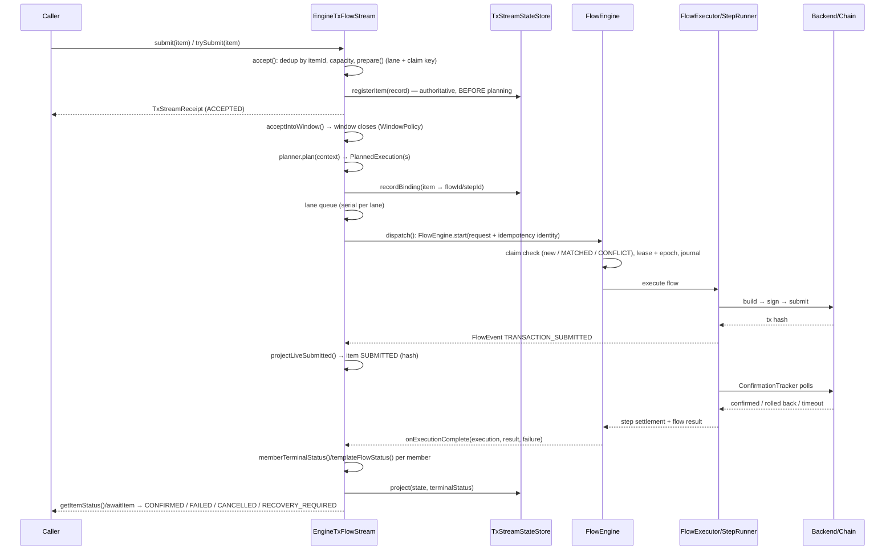

# TxStream Internals — Design & Maintainer Guide

**Audience:** CCL maintainers and contributors who need to understand how `TxFlowStream`
is implemented before touching the code. This document explains the architecture, the
end-to-end path of a work item, the exactly-once machinery, and the invariants that must
not be broken. Read it before opening `EngineTxFlowStream.java` (~5,000 lines).

Related docs: [DESIGN_AND_USAGE.md](DESIGN_AND_USAGE.md) (user-facing API),
[TXFLOW_ENGINE_INTERNALS.md](TXFLOW_ENGINE_INTERNALS.md) (FlowEngine internals —
claims, leases, journal, recovery, and the canonical uncertain-disposition contract),
[DURABLE_RUNTIME.md](DURABLE_RUNTIME.md) (store contract in outline),
[Flowexecutor-code-flow.md](Flowexecutor-code-flow.md) (portable executor),
ADR `adr/txflow/002-txflowstream-concept.md` (original concept).

---

## 1. What TxStream is and where it sits

TxStream is a **continuous transaction processing runtime**: callers push work items
(payments, mints, contract calls) into a stream; the stream plans them into transaction
flows, executes them through the durable `FlowEngine`, and projects a per-item status a
caller can query, await, or reconcile. It is the top layer of the txflow stack:

```
┌───────────────────────────────────────────────────────────────┐
│ TxFlowStream (stream/)                                        │
│   items → lanes → windows → planner → executions → receipts   │
├───────────────────────────────────────────────────────────────┤
│ FlowEngine (exec/FlowEngine.java)                             │
│   idempotency claims · leases/fencing · WAL journal · recover │
├───────────────────────────────────────────────────────────────┤
│ FlowExecutor + StepRunner (exec/)                             │
│   build → sign → submit → ConfirmationTracker → settle step   │
├───────────────────────────────────────────────────────────────┤
│ TxFlow / FlowStep / TxPlan (compile/, yaml/, quicktx)         │
│   declarative flow definitions, YAML or Java                  │
├───────────────────────────────────────────────────────────────┤
│ Backend abstractions (api/, backend)                          │
│   UtxoSupplier · TransactionProcessor · ChainDataSupplier     │
└───────────────────────────────────────────────────────────────┘
```

Each layer only talks to the one below it. The stream never builds or submits
transactions itself — it compiles work items into `FlowExecutionRequest`s and hands them
to the engine through the `EngineGateway` seam (which exists so tests can fake the
engine).

---

## 2. Source map

Everything lives in `txflow/src/main/java/com/bloxbean/cardano/client/txflow/`:

| Path | Role |
|---|---|
| `stream/TxFlowStream.java` | Public interface + `Builder`. Lifecycle: `start()`, `reattach()`, `bootstrap()`, `submit()`, `trySubmit()`, `cancelItem()`, `getItemStatus()`, `reconcile()`, `drain()` |
| `stream/EngineTxFlowStream.java` | **The implementation.** One large file, by design: item acceptance, lanes, windows, dispatch, projection, reattach all share tightly-coupled state guarded by the same locks |
| `stream/TxStreamPlanner.java`, `BuiltInPlanners.java` | Planner SPI + `perItem()` / `perWindow()` / `batching()` |
| `stream/LanePolicy.java`, `ResolvedLane.java`, `PartitionedLanes.java`, `LaneIdentityResolver.java` | Lane identity and resolution |
| `stream/WindowPolicy.java` | Window close rules: `count(n)`, `time(d)`, `countOrTime(n, d)` |
| `stream/StableIdFactory.java` | Deterministic flow/step id derivation (ADR 0004 Decision 3) |
| `stream/TxStreamStateStore.java`, `InMemoryTxStreamStore.java`, `InMemoryDurableTxStreamStore.java` | Stream-side persistence SPI |
| `exec/FlowEngine.java` | Durable engine: `start(request)`, `recover(request)` |
| `exec/FlowExecutor.java` | Chaining-mode execution (SEQUENTIAL / PIPELINED / BATCH), rollback handling, uncertain-disposition settlement, legacy `resumeSync`/`resume` |
| `exec/StepRunner.java` | Single-step build/sign/submit/confirm |
| `exec/ConfirmationTracker.java`, `ConfirmationOutcome.java` | Confirmation polling, rollback detection, outcome typing |
| `exec/DurableLeaseGuard.java`, `store/MutationFence.java` | Lease + fencing-epoch enforcement on store writes |
| `txflow-extensions/txflow-store-rdbms/` | JDBC store (H2/PostgreSQL), schema in `src/main/resources/db/` |

> **Tooling note:** `EngineTxFlowStream.java` is ~247 KB. Some grep wrappers silently
> return nothing on files this large — if a search comes back empty, retry with
> `/usr/bin/grep` before concluding the symbol doesn't exist.

---

## 3. Core concepts

- **Item (`TxWorkItem`)** — one unit of caller intent: item id (unique per submission),
  idempotency key (unique per *business intent*), payload (amounts/addresses or a
  template reference), optional lane hint.
- **Lane** — the canonical *spending identity* (funding address/resource). All items in
  one lane are executed serially so their transactions can chain UTXOs without
  conflicting. Parallelism across the stream comes from having multiple lanes.
- **Window** — a buffer of accepted items that closes per `WindowPolicy` and is handed
  to the planner as one planning unit.
- **Planner (`TxStreamPlanner`)** — pure function from a planning context (window items +
  `StableIdFactory`) to a `TxStreamPlan`: which items become which flows, with which
  flow/step ids.
- **Execution (`ExecutionState`)** — one engine run of one planned flow; carries its
  member item refs and the engine handle.
- **Projection (`ItemProjection` / `TxStreamItemResult`)** — the stream's answer to
  "what happened to my item", advanced monotonically as evidence arrives.
- **Claim** — the engine-side idempotency record keyed by the flow's idempotency
  identity; the mechanism that makes redelivery safe.

### Item status lifecycle (`TxStreamItemStatus`)

```
ACCEPTED → PLANNED → SUBMITTED → CONFIRMED        (happy path)
                          │
                          ├→ FAILED               (conclusive failure; hash retained if submitted)
                          ├→ CANCELLED            (never produced a confirmed tx)
                          └→ RECOVERY_REQUIRED    (outcome UNKNOWN — not terminal-final;
                                                   read-through reconcile() may advance it)
```

`SUBMITTED` is only projected after the engine emits `TRANSACTION_SUBMITTED` — the
stream never asserts submission ahead of the backend. `RECOVERY_REQUIRED` is the
honest "I don't know" state: the transaction may still be on chain. It is settled in
the store but *repairable*: `getItemStatus()` / `reconcile()` re-read the engine
snapshot and advance the projection when the engine has an authoritative answer.

---

## 4. Life of an item (the end-to-end path)

This is the single most useful mental model for reading the code. Method names refer to
`EngineTxFlowStream` unless stated otherwise.



### 4.1 Acceptance — `accept(TxWorkItem, boolean blocking)`

Order matters here; each step exists to close a specific race:

1. **Item-id dedup first**: an existing `ItemState` for the same item id means
   redelivery → `attachOrConflict` (same fingerprint attaches to the in-flight/settled
   item; different content conflicts with `TxStreamDuplicateItemException`).
2. **Capacity**: a semaphore bounds buffered items. `submit()` blocks;
   `trySubmit()` returns `EmitResult` `FULL` without blocking.
3. **`prepare(item)`**: resolves the lane (`LanePolicy`/`LaneIdentityResolver`),
   computes the content fingerprint and the **claim key**. Failures here are typed
   *content* outcomes (`TXSTREAM_INVALID_ITEM`, validation failures) — except
   `TXSTREAM_LANE_UNRESOLVED`, which is transient infrastructure: it settles the item
   typed but retains nothing, so a later redelivery retries fresh instead of attaching
   to a poisoned failure.
4. **Claim-key uniqueness across live items**: reusing an idempotency key under a *new*
   item id is rejected (`TXSTREAM_IDEMPOTENCY_KEY_REUSE`) — redelivery must reuse the
   original item id, or (after the original id settled `CANCELLED`) a new item id may
   carry the original key so the engine claim still deduplicates.
5. **`stateStore.registerItem(...)` — the authoritative write, and it happens BEFORE
   planning.** This is deliberate and planner-independent: the store is the dedup guard.
   If registration fails, the accept **fails closed** (the item is rejected, never
   half-admitted). If this ordering is ever reversed, restart-time dedup breaks for
   items that were planned but not yet registered.

### 4.2 Windowing and planning

Accepted non-template items go to the current window (`acceptIntoWindow`). The window
closes by `WindowPolicy` (`count` / `time` / `countOrTime`) → `closeWindowLocked()` →
the planner maps the window to `PlannedExecution`s (`dispatchBatch`). Template items
(`Builder.template(id, flow)`) skip windowing — each invocation owns a whole flow and is
dispatched via `dispatchTemplate`.

**Planner determinism is a hard SPI obligation** (see `StableIdFactory` javadoc, ADR
0004 Decision 3): the same window items, in any order, must produce a byte-identical
plan — flow ids, step ids, claim keys, transaction content, member mapping. Flow ids
derive from the **sorted member idempotency keys**, never from batch sequence, window
position, timestamps, or counters. The engine fingerprints the compiled request under
the flow's claim; a non-deterministic planner turns legitimate redeliveries into
`TXFLOW_IDEMPOTENCY_CONFLICT` failures instead of idempotent matches.

### 4.3 Lanes and dispatch

Each `PlannedExecution` is queued on its lane (`LaneQueue`) and lanes are drained
serially — one in-flight execution per lane. This is what lets consecutive
transactions from one funding address chain safely. `dispatch(execution)` builds the
`FlowExecutionRequest` (flow definition + idempotency identity from the plan) and calls
`FlowEngine.start(...)` through the gateway, registering a completion observer. If that
observer cannot be registered, the execution is running *unobserved* — members are
projected `RECOVERY_REQUIRED` (not FAILED), because the outcome is unknown, and
`onSystemicFailure` is raised.

Lane modes (`LanePolicy`):

| Mode | Identity source | Use |
|---|---|---|
| `single(lane)` | One fixed lane | Simple apps, one funding wallet |
| `explicit()` | `TxWorkItem.lane` hint, required | Caller controls partitioning |
| `byFundingAddress()` | Derived from the item's funding address | Natural per-wallet serialization |
| `partitioned(config)` | Hash-partitioned over N lanes | Throughput scaling over one identity |

### 4.4 Engine execution

`FlowEngine.start(request)`:

1. **Idempotency claim**: a durable claim keyed by the request's idempotency identity.
   New claim → run. Existing claim with same fingerprint → **MATCHED**: returns the
   stored terminal result with a `TXFLOW_STORED_EXECUTION_TERMINAL` marker — note that
   this result has **empty `steps()`/`attempts()`**; details must be read from
   `store.get(executionId)` (the stream's `SnapshotLookup` does exactly this).
   Same identity, different fingerprint → `TXFLOW_IDEMPOTENCY_CONFLICT`.
2. **Leases + fencing**: an execution lease (and resource leases for spending
   identities) with a monotonic **fencing epoch** from the `txflow_lease_epoch`
   singleton (CAS-incremented). Every store mutation goes through `MutationFence` /
   `DurableLeaseGuard` carrying that epoch, so a zombie process that lost its lease
   cannot corrupt state — its writes are fenced out.
3. **Write-ahead journal**: `FlowEventType` events (`EXECUTION_STARTED`,
   `TRANSACTION_SUBMITTED`, `TRANSACTION_CONFIRMED`, `STEP_COMPLETED`, …,
   `RECOVERY_REQUIRED`) recorded via `ExecutionJournalSession` before effects are
   acknowledged.
4. **Execution** through `FlowExecutor`/`StepRunner`; confirmation via
   `ConfirmationTracker` (which needs `TransactionObservationCapabilities
   .supportsAuthoritativeAbsence()` to distinguish "not seen yet" from "authoritatively
   absent" for rollback detection).

### 4.5 Live projection

The stream tails engine events per execution (`state.eventCursor` tracks the last
consumed sequence). `TRANSACTION_SUBMITTED` for an item's step →
`projectLiveSubmitted(state)` → status `SUBMITTED` with the hash. Hash selection is
deliberately consistent everywhere: **the LATEST submitted attempt wins** — see
`hashFromEvents` / `hashFromAttempts` / `hashFromAnyEvent` (template items take the
latest hash across the whole flow, since a template invocation owns the flow, not one
step).

### 4.6 Terminal projection

`onExecutionComplete(execution, result, failure)`:

- `failure != null || result == null` → the engine's completion path itself broke
  (infrastructure, not chain outcome) → `failMembers(..., "TXSTREAM_EXECUTION_FAILED", ...)`.
- Otherwise each member is mapped by **`memberTerminalStatus(stepResult, flowState)`**
  (per-member, step result takes precedence) or **`templateFlowStatus(flowState)`**
  (template items, flow-level):

`memberTerminalStatus` precedence (read the javadoc above it in the source — it is the
contract):

| Evidence | Projected status |
|---|---|
| Step `IN_PROGRESS` (submission-pending, hash known, outcome unknown) | **RECOVERY_REQUIRED** — checked FIRST, beats everything |
| Flow `ROLLED_BACK` | FAILED |
| Step `COMPLETED` / `FAILED` / `CANCELLED` | CONFIRMED / FAILED / CANCELLED |
| No step result, flow `COMPLETED` | CONFIRMED (MATCHED stored flow with compacted steps) |
| No step result, flow `FAILED` or `PARTIALLY_COMPLETED` | FAILED — safe because engine semantics guarantee **no step of a FAILED flow confirmed** (uncertain flows are elevated to RECOVERY_REQUIRED instead, see §6) |
| Flow `RECOVERY_REQUIRED` (or anything else) | RECOVERY_REQUIRED |

Template projection first checks step and durable-attempt evidence through
`templateTerminalStatus` / `templateSnapshotStatus`: a `CANCELLED` flow with any
submitted-but-undecided transaction projects `RECOVERY_REQUIRED`. Only after that check
does the state-only `templateFlowStatus` mapping apply: `COMPLETED`→CONFIRMED,
`FAILED`/`ROLLED_BACK`→FAILED, `CANCELLED`→CANCELLED,
`PARTIALLY_COMPLETED`/`RECOVERY_REQUIRED`/default→RECOVERY_REQUIRED.

All projection writes funnel through `project(state, target, mutator, …)`, which
enforces monotonic advancement and store persistence.

---

## 5. Exactly-once: how it actually holds

Exactly-once is not one mechanism; it is four layered guards, each closing a different
window:

1. **Stream item registry** (`stateStore.registerItem` in `accept()`): survives restart;
   a redelivered item id is recognized before any planning happens.
2. **Live claim-key map** (`itemIdByClaimKey`): rejects two *different* live items
   carrying one idempotency key.
3. **Engine idempotency claim** (`txflow_idempotency`): the last line of defense —
   even if the stream re-plans after a crash, `FlowEngine.start` with the same identity
   and fingerprint MATCHES the stored execution instead of re-running it.
4. **Deterministic identities** (`StableIdFactory`): guarantee that a re-plan of the
   same items produces the same claim identity, so guard 3 can actually match.

**Claim scope differs by planner** — this is the subtle part:

- `perItem()`: one flow per item → claim identity derives from that single item's key →
  per-item exactly-once, independent of windowing.
- `perWindow()` / `batching()`: one flow per window/batch → claim identity derives from
  the **sorted member keys of the whole flow**. Exactly-once holds at flow granularity:
  a redelivered *subset* of a previous batch forms a *different* member set → different
  identity → a fresh flow. Sources that require per-item dedup under batching must
  dedup upstream, or rely on the item registry (guard 1) rejecting known item ids.

**Redelivery contract** (verified behavior, see §7): an item that settled `CANCELLED`
terminally consumes its item id — resubmission must use a **new item id with the
original idempotency key**; use `trySubmit()` when reconciling batches so conflicts
report as `EmitResult` instead of throwing.

---

## 6. Uncertainty: the RECOVERY_REQUIRED contract

> The canonical, engine-level statement of this contract lives in
> [TXFLOW_ENGINE_INTERNALS.md](TXFLOW_ENGINE_INTERNALS.md) §7 (including how `run()`
> elevates state, the journal-agreement rule, and `StepRunner`'s uncertain-submission
> path). This section covers the contract as the **stream** experiences and projects it.

This is the most important invariant in the codebase, hardened after a production-style
preprod soak run found timeout items settled `FAILED` while their transactions were on
chain (a reconciler then "double paid" them).

> **A submitted transaction whose outcome is unknown must NEVER settle as FAILED.**

"Unknown outcome" arises from: confirmation timeout, uncertain submission (the submit
call failed in a way that doesn't prove the tx didn't reach the mempool), uncertain
reconciliation, and exhausted `WAIT_FOR_REINCLUSION` windows after a rollback. These
get the **full** uncertain contract described below. Cancellation during confirmation
is a *partial* case — the step settles pending, but flow/engine/journal settle
`CANCELLED`; see the subsection after the table.

### The two encodings of uncertainty

Uncertainty is carried in **two independent channels**, and both must be checked:

1. **Outcome type**: `ConfirmationOutcome.Type` ∈ {`TIMEOUT`, `CANCELLED`,
   `RECOVERY_REQUIRED`} (vs conclusive `CONFIRMED`/`ROLLED_BACK`/`FAILED`).
   `CANCELLED` only gets the step-level pending settlement, not the full contract —
   see "Cancellation during confirmation" below.
2. **Error chain**: `ConfirmationTimeoutException` or `ReconciliationUncertainException`
   anywhere in the cause chain — some rollback policies deliberately preserve a
   `ROLLED_BACK` outcome (so rollback persistence and hooks still run) while carrying
   the uncertainty in the error chain.

`FlowExecutor.isUncertainDisposition(confirmation)` checks both. If you add a new
uncertain path, it must surface through one of these two channels or it will be
mis-settled — this dual check is what ended a long series of "one more missed path"
review findings.

### What uncertain settlement looks like, at every layer

This table applies to the full-contract sources: confirmation timeout, uncertain
submission, uncertain reconciliation, and exhausted reinclusion — **not** to
cancellation (next subsection).

| Layer | Certain failure | Uncertain disposition |
|---|---|---|
| Step result (`FlowStepResult`) | `FAILED` (+hash if submitted) | **`submissionPendingAt(...)`: `IN_PROGRESS` + hash + cause** |
| Flow result (legacy `FlowResult`) | `FAILED` with `getFailedStep()` | `FAILED` with **empty `getFailedStep()`** — inspect `getStepResults()`/`getError()` |
| Engine state (`FlowExecutionState`) | `FAILED` | **`RECOVERY_REQUIRED`** (elevated in `FlowEngine.run`) |
| Listener (`FlowListener`) | `onStepFailed` / `onFlowFailed` | **`onStepUncertain` / `onFlowUncertain`** — routed via the sole choke points `notifyStepTerminal` / `notifyFlowTerminal` in `FlowExecutor`; `CompositeFlowListener` forwards both |
| Journal (`FlowEventType`) | `STEP_FAILED` / `EXECUTION_FAILED` | **`RECOVERY_REQUIRED`** (step-scoped with stepId+hash, and flow-scoped) |
| Stream projection | `FAILED` | **`RECOVERY_REQUIRED`** (non-final; read-through repair) |
| `FlowError.retryable` | per category | **per-request truth**: `true` only when a durable store is attached or the request carries an explicit idempotency key (a retry can attach to the claim); keyless non-durable retry would be fresh work → `false` |
| Legacy `resumeSync`/`resume` | re-executes from failed step | **refuses** (`IllegalStateException`) when the previous result contains an `IN_PROGRESS`+hash step — re-executing could duplicate a tx that may still confirm; reconcile on chain first |

> **Note on pending `outputUtxos`:** a submission-pending step's `outputUtxos` are
> **not guaranteed**. The `FlowExecutor` settlement sites preserve the captured outputs
> of the submitted transaction, but `StepRunner.uncertainFailure` settles with an empty
> list. Never rely on a pending step's outputs for dependency resolution or repair —
> the transaction hash is the authoritative handle.

### Cancellation during confirmation — a partial case

`isUncertainDisposition` includes `ConfirmationOutcome.Type.CANCELLED`, so the **step**
still settles `submissionPendingAt` (`IN_PROGRESS` + hash) — a cancelled wait proves
nothing about whether the transaction will land. But everything above the step layer
diverges from the table: the cancel branch in `FlowExecutor`'s terminal handling
returns through `cancelledFlowResult(...)` *before* the step-terminal notification
runs.

- **Flow / engine / journal**: flow result is `FlowStatus.CANCELLED`, engine state is
  `FlowExecutionState.CANCELLED`, and the journal records `EXECUTION_CANCELLED` —
  there is no `RECOVERY_REQUIRED` elevation and no recovery-required journal events.
- **Listeners**: `onStepUncertain` / `onFlowUncertain` are **not** emitted. The step
  gets no terminal callback at all, and the flow-terminal routing sees a
  `CancellationException` (not an uncertain error chain), so the listener observes
  `onFlowFailed` carrying the `CANCELLED` result.
- **Stream projection (ordinary/shared members)**: unchanged from the table —
  `memberTerminalStatus` checks step `IN_PROGRESS` first, so a submitted-then-cancelled
  member still projects `RECOVERY_REQUIRED` (the transaction may land and must be
  reconciled); members that never submitted project `CANCELLED`.
- **Stream projection (template items)**: `templateTerminalStatus` checks live pending
  step/attempt evidence and `templateSnapshotStatus` checks durable attempt evidence
  before the state-only mapping. A submitted-then-cancelled template therefore projects
  `RECOVERY_REQUIRED` consistently across live completion, restart/reattach, and
  read-through reconciliation; a template cancelled before submission remains
  terminal `CANCELLED`.
- **Resume**: the resume guard refuses these results too — the pending step is
  `IN_PROGRESS` + hash, and re-executing it carries the same double-pay risk.

### Repair paths

- **Durable engine path**: restart → `stream.reattach()` / `engine.recover(...)` —
  submitted-but-undecided items come back `RECOVERY_REQUIRED`; `reconcile(itemId)`
  consults the engine snapshot and advances the projection when authoritative.
  Check the retained hash on chain before any manual resubmission — blind resubmission
  double-pays.
- **Portable path** (no store): the caller owns reconciliation. The pending hash is on
  the step result; verify it on chain; only rebuild once the transaction can no longer
  land.

**When adding new failure handling, the litmus test is:** *can I prove the transaction
is not, and will never be, on chain?* If not, it is uncertain — settle pending, elevate
to RECOVERY_REQUIRED, notify uncertain.

---

## 7. Durability & crash recovery

### Store schema (RDBMS module, H2 + PostgreSQL)

| Engine (`db/txflow/`) | Stream (`db/txstream/`) |
|---|---|
| `txflow_execution` — execution snapshots (steps, attempts, state) | `txstream_item` — registered items (id, claim key, lane, fingerprint) |
| `txflow_idempotency` — claims | `txstream_binding` — item → flow/step binding |
| `txflow_event` — WAL journal | `txstream_planned` — planned records |
| `txflow_execution_lease`, `txflow_resource_lease` — leases | `txstream_batch` — batch/window records |
| `txflow_lease_epoch` — fencing-epoch singleton (CAS) | `txstream_bootstrap`, `txstream_ownership` — bootstrap + ownership lease |

### Verified restart behavior (after a hard `Runtime.halt()`)

- Completed items → re-projected `CONFIRMED` from the store.
- Submitted-but-undecided → `RECOVERY_REQUIRED`; the tx can still be on chain.
- Accepted but never bound to an execution → `CANCELLED` (not "absent") — redeliver
  under a new item id with the original idempotency key (§5).
- The crashed process's **resource lease survives it**; until it expires (default TTL
  30s, `FlowEngine.builder(...).leaseDuration(...)`), redelivery fails with "Resource is
  already leased". This is correct fencing, not a bug.
- **Ownership** (`Builder.ownership(token, leaseDuration)`, `txstream_ownership`): only
  one stream instance owns a stream id at a time; failover happens by lease expiry
  (`OwnershipStatus`, `StreamOwnershipLease`).

---

## 8. Threading & backpressure

- `submit()` blocks on the capacity semaphore (`maxBufferSize`); `trySubmit()` doesn't.
- `maxInFlight` bounds concurrent executions; lanes serialize within themselves.
- A `maintenanceExecutor` (scheduled) drives window timers and periodic reconciliation
  (`reconciliationInterval`/`reconciliationBatchSize`). Without it the stream owns no
  threads/timers — read-through `getItemStatus()`/`reconcile()` still work (build-time
  warning in `TxFlowStream.Builder.build()`).
- Source integration: `FlowWorkSource`/`TxWorkSource` push into the stream; the stream
  applies backpressure by pausing/resuming the source (`source.resume()` when capacity
  frees).
- Settled items are retained up to `maxRetainedSettledItems` for status queries, then
  compacted (the store remains authoritative).

---

## 9. Invariants — do not break these

1. **Register before plan.** `stateStore.registerItem` happens in `accept()`, before
   any planner sees the item. The store is the dedup guard; planning is downstream.
2. **Never settle uncertain as FAILED** (§6). New failure paths must carry uncertainty
   via `ConfirmationOutcome.Type` or the exception chain, and route listeners through
   `notifyStepTerminal`/`notifyFlowTerminal`.
3. **No step of a FAILED flow confirmed.** `memberTerminalStatus` relies on it when
   mapping members without step results. Uncertain elevation to `RECOVERY_REQUIRED`
   is what keeps this true.
4. **Planners are deterministic** over sorted member keys — no timestamps, counters,
   randomness, or iteration-order dependence (ADR 0004 Decision 3).
5. **`SUBMITTED` only from `TRANSACTION_SUBMITTED`.** Never project submission ahead of
   backend evidence.
6. **Latest-submitted-hash wins** consistently across `hashFromEvents`,
   `hashFromAttempts`, `hashFromAnyEvent`.
7. **Projections advance monotonically** and always through `project(...)`.
8. **Every fenced write carries its epoch.** New store mutations go through
   `MutationFence`/`DurableLeaseGuard`; never write around them.
9. **MATCHED engine results have empty steps/attempts** — always read details from the
   store snapshot (`SnapshotLookup`), never assume the in-memory result is populated.
10. **Settle before remove** in `accept()` rejection paths: a receipt attached
    concurrently must settle, never hang on a removed item; rejected items must not
    bump accepted/failed counters (`suppressStoreProjection`/`suppressCounters`).
11. **Resume refuses pending steps.** `validateResumeArgs` throws on `IN_PROGRESS`+hash
    step results; do not "fix" this by re-executing them.

---

## 10. Test map — where the invariants are pinned

| Concern | Tests |
|---|---|
| Uncertain settlement (engine state, journal events, retryable) | `FlowEngineTest`: `confirmationTimeoutSettlesRecoveryRequiredNotFailed`, `confirmationTimeoutJournalsRecoveryRequiredEventsNotFailureEvents`, `batchUnknownSubmissionObservationFailureIsDurablyRecoveryRequired`, `reconciliationUncertaintyNestedUnderRollbackMapsToRecoveryRequired` |
| Uncertain settlement (executor, listeners, pending step results) | `FlowExecutorTest`: timeout trio, uncertain-submission tests, `portableWaitForReinclusionExhaustsAtWindowNotRecoveryCycleCount`, `testResumeSync_submissionPendingStep_refusesResume` |
| Stream projection & lifecycle | `stream/` tests around `EngineTxFlowStream` (acceptance, dedup, claim-key reuse, reattach, reconcile), including `TxFlowStreamTemplateTest.submittedThenCancelledTemplateRequiresRecoveryUntilAttemptIsResolved` and `durablePresentCancelledTemplateWithSubmittedAttemptReattachesRecoveryRequired` |
| Durable stores | `txflow-store-rdbms` tests (`RdbmsSchemaManagerTest`, store round-trips) |
| End-to-end under chaos (crash / rollback / failover, chain-as-oracle reconciliation) | `txflow-extensions/txflow-soak` (see its README; run against Yaci DevKit or preprod) |

Run: `./gradlew :txflow:test` (unit), `:txflow-extensions:txflow-store-rdbms:test`,
soak via the fat jar in `txflow-extensions/txflow-soak`.

---

## 11. Suggested reading order for a new maintainer

1. This document, then [DESIGN_AND_USAGE.md](DESIGN_AND_USAGE.md) for the user's view.
2. `TxFlowStream.java` — the interface + builder javadoc (the contract).
3. `TxStreamItemStatus`, `FlowExecutionState`, `ConfirmationOutcome`, `FlowEventType` —
   the vocabulary.
4. `EngineTxFlowStream.accept(...)` → `dispatch(...)` → `onExecutionComplete(...)` →
   `memberTerminalStatus(...)` — the spine of §4, in code.
5. `FlowEngine.start(...)` with [TXFLOW_ENGINE_INTERNALS.md](TXFLOW_ENGINE_INTERNALS.md)
   and [DURABLE_RUNTIME.md](DURABLE_RUNTIME.md).
6. `FlowExecutor.isUncertainDisposition(...)` and the `notify*Terminal` choke points.
7. ADRs: `adr/txflow/002-txflowstream-concept.md`,
   `adr/004-txflow-production-readiness-rollback-design.md`.
