# TxStream Design

**Audience:** engineers who need to understand *how TxStream works* — architecture, end-to-end flow, every major subsystem, and the edge cases that decide funds safety.

This is the design document for the shipped `TxFlowStream` API (`com.bloxbean.cardano.client.txflow.stream`). It describes the system as implemented, not a proposal.

| Document | Role |
|---|---|
| This file | Architecture, diagrams, status machines, edge cases |
| [TXSTREAM_INTERNALS.md](TXSTREAM_INTERNALS.md) | Maintainer invariants before touching `EngineTxFlowStream` |
| [TXSTREAM_READINESS_REPORT.md](TXSTREAM_READINESS_REPORT.md) | API readiness, quality ranking, punch list |
| [TXSTREAM_API_DX.md](TXSTREAM_API_DX.md) | Beginner-friendly API refactor proposal |
| ADR [0004](../adr/0004-txstream-on-flow-engine.md) | Normative decisions (lanes, idempotency, projection, durability, lifecycle) |
| Public guides | [Getting started](../../docs/content/preview/txflow/txstream-getting-started.mdx), [durability](../../docs/content/preview/txflow/txstream-durability.mdx), [throughput](../../docs/content/preview/txflow/txstream-throughput.mdx) |
| Engine internals | [TXFLOW_ENGINE_INTERNALS.md](TXFLOW_ENGINE_INTERNALS.md) — claims, leases, journal, uncertain disposition |

---

## 1. What TxStream is

TxStream is a **continuous transaction processing runtime**. Callers push work items (payments, mints, contract calls, parameterized template invocations). The stream:

1. Accepts each item idempotently (redelivery attaches instead of double-paying).
2. Groups items into **windows** (optional).
3. Asks a **planner** to turn a window into one or more **flows**.
4. Executes those flows through `FlowEngine` on **lanes** (funding scopes).
5. Projects a per-item status a caller can query, await, or reconcile.

It is the top of the txflow stack. It never builds or submits a Cardano transaction itself.

```
┌─────────────────────────────────────────────────────────────────┐
│ TxFlowStream                                                     │
│  items → lanes → windows → planner → executions → receipts      │
├─────────────────────────────────────────────────────────────────┤
│ FlowEngine                                                       │
│  idempotency claims · leases/fencing · WAL journal · recover    │
├─────────────────────────────────────────────────────────────────┤
│ FlowExecutor + StepRunner                                        │
│  build → sign → submit → ConfirmationTracker → settle step      │
├─────────────────────────────────────────────────────────────────┤
│ TxFlow / FlowStep / TxPlan (portable definitions)                │
├─────────────────────────────────────────────────────────────────┤
│ Backend: UtxoSupplier · TransactionProcessor · ChainDataSupplier │
└─────────────────────────────────────────────────────────────────┘
```

**When to use it.** Submitting *many* transactions over time where each must land exactly once and survive process death. **When not to.** One-off payments (QuickTx), a single multi-step workflow (`TxFlow` + `FlowEngine` directly), on-chain-atomic multi-party logic (a validator), or latency-critical paths (confirmation latency dominates).

**Status.** Preview / experimental on the `0.8.0-pre*` line. Java 17. The stream, like `FlowEngine`, only ever runs on **caller-owned executors** — it never creates threads or timers.

---

## 2. Core concepts

| Concept | Meaning |
|---|---|
| **Item (`TxWorkItem`)** | One unit of caller intent: an item id, an idempotency key, a portable payload (`TxPlan`, portable `FlowStep`, or template + bindings), optional lane hint and metadata. |
| **Lane** | A *funding scope* (address or funding ref). At most one execution is in flight per **canonical spending identity**. Different identities run concurrently. Alias names that resolve to one identity share one FIFO. |
| **Window** | A buffer of accepted items closed by count, age, or `flush()` / `drain()` / `close()`. Handed to the planner as one planning unit. No window policy ⇒ window of one, planned immediately. |
| **Planner (`TxStreamPlanner`)** | Pure function: window items + `StableIdFactory` → `TxStreamPlan` (list of `PlannedExecution`). Must be deterministic. |
| **Execution** | One engine run of one planned flow. Members ride steps of that flow (or share one step, under batching). |
| **Claim** | Engine-side idempotency record. Same identity + same fingerprint → `MATCHED`; different fingerprint → conflict. |
| **Projection** | The stream's answer to "what happened to my item". Advances monotonically from engine evidence. |
| **Receipt (`TxStreamReceipt`)** | Returned at accept. Exposes `completion()` (`CompletionStage`), `current()`, `executionId()`, event cursor. |
| **Binding** | Authoritative stream-store record: item → `(executionId, stepId, lane)` written *before* `FlowEngine.start`. |

---

## 3. Public front door

```java
FlowEngine engine = FlowEngine.builder(utxoSupplier, protocolParamsSupplier,
        transactionProcessor, chainDataSupplier)
        .executor(engineExecutor)
        .store(executionStore)                 // required for durable streams
        .maintenanceExecutor(engineMaintenance)
        .signerRegistry(signers)
        .build();

try (TxFlowStream stream = TxFlowStream.builder("payouts", engine)
        .lane(ResolvedLane.ofFundingRef("payouts", "account://sender"))
        .executor(streamExecutor)              // required today
        .build()) {
    stream.start();

    TxStreamReceipt receipt = stream.submit(
            TxWorkItem.builder("pay-0042")
                    .withTxPlan(plan)
                    .withIdempotencyKey("order-0042")
                    .build());

    TxStreamItemResult outcome = receipt.completion().toCompletableFuture().join();
}
```

Builder knobs (progressive disclosure):

| Knob | Default | Required when |
|---|---|---|
| `lane(...)` / `lanes(...)` | none — **required at build** | always (today) |
| `laneResolver(...)` | none | `LanePolicy.explicit()` |
| `planner(...)` | `perItem()` | — |
| `window(...)` | immediate windows of one | grouping / batching |
| `executor(...)` | none — **required at build** | always (today) |
| `maintenanceExecutor(...)` | none | time-based window, reconciliation observer, or ownership |
| `stateStore(...)` | in-memory (non-durable) | crash recovery / HA |
| `source(...)` | in-memory | `Flow.Publisher` ingestion |
| `maxBufferSize` | 1,000 | backpressure |
| `maxInFlight` | 16 | global cap across lanes |
| `maxRetainedSettledItems` | 10,000 | live-map / in-memory store bound |
| `template(id, flow)` | none | parameterized invocations |
| `ownership(token, ttl)` | off | active/standby HA |
| `reconciliationInterval(...)` | off (read-through only) | push-repair of `RECOVERY_REQUIRED` |

`try`-with-resources is safe: `close()` is **graceful** (drain, then release). Nothing is cancelled. Forced shutdown is `abort(reason)` or `close(Duration grace)`.

---

## 4. End-to-end: life of an item

This is the single most useful mental model.

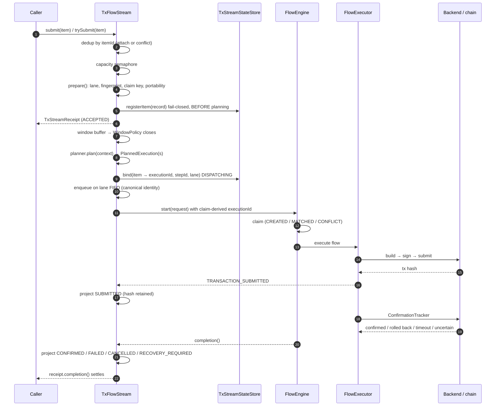

Template items skip the window and the planner: each invocation is already a whole compiled flow and is queued on its lane as a single-member execution.

---

## 5. Acceptance path

Order is load-bearing. Each step exists to close a specific race.

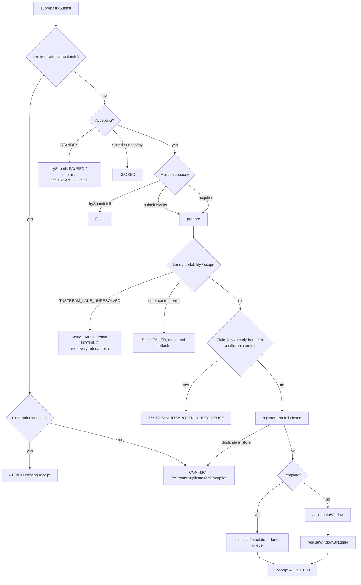

Notes:

- **Item-id dedup first**, before capacity. A redelivery of a live item never consumes a permit.
- **`registerItem` happens before planning.** The store is the durable dedup guard. Reverse this and restart-time dedup breaks.
- **Settle-before-remove** on rejected accept paths: a receipt attached concurrently must settle, never hang on a removed item. Rejected items do not bump accepted/failed counters (`suppressStoreProjection` / `suppressCounters`).
- **`submit` vs `trySubmit`.** `submit` blocks on the capacity semaphore and throws on conflict / closed / reuse. `trySubmit` never throws for content outcomes: they become `EmitResult` statuses. A `null` item is still an NPE at both entries (programming error).
- **`EmitResult.OK` with a FAILED receipt.** Eager validation failures (non-portable payload, lane mismatch, …) still return `OK` plus a receipt whose `completion()` is already `FAILED`. `isAccepted()` is true. Check `receipt.current().getStatus()`.

---

## 6. Windowing and planning

Accepted non-template items go into `windowBuffer` (guarded by `stateLock`).

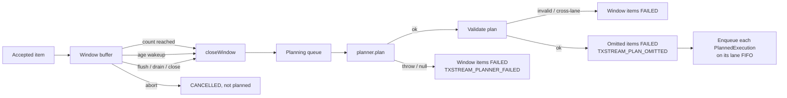

**WindowPolicy**

| Factory | Closes when | Needs `maintenanceExecutor` |
|---|---|---|
| `count(n)` | `n` items (or flush/drain/close) | no |
| `time(d)` | oldest item age `d` | **yes** |
| `countOrTime(n, d)` | whichever comes first | **yes** |
| none | every item immediately (window of 1) | no |

A **count-only** window whose `maxItems` exceeds `maxBufferSize` is rejected at `build()`: the window could never fill and blocking `submit` would hang forever.

Age wakeups run on the caller-owned scheduler. The stream owns no threads. A window epoch invalidates a stale wakeup after the window closed early.

**Planner SPI contract**

- Pure: no I/O, no clocks, no randomness.
- **Deterministic:** the same window items, in any order, must produce a byte-identical plan (flow ids, step ids, claim keys, transaction content, member mapping). Identities derive from **sorted member idempotency keys** via `StableIdFactory` — never batch sequence, window position, or timestamps. A non-deterministic planner turns legitimate redeliveries into `TXFLOW_IDEMPOTENCY_CONFLICT`.
- Isolation: a throwing planner fails **only that window**, typed `TXSTREAM_PLANNER_FAILED`. The stream stays healthy.
- Validation the stream *does*: duplicate mappings, foreign/unmapped items, orphan steps, cross-lane flows (`TXSTREAM_PLAN_INVALID` / `TXSTREAM_PLAN_CROSS_LANE`). Omitted items fail `TXSTREAM_PLAN_OMITTED`; the rest proceeds.
- Validation the stream *cannot* do: that a shared step's transaction actually pays every mapped item. That is the planner's obligation. Built-in `batching()` is correct by construction.

The default `perItem()` planner with no window is planned **inline on the accepting thread** (`inlinePlanning`) so FIFO lane order matches accept order.

---

## 7. Built-in planners

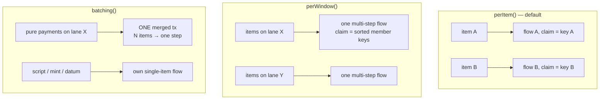

| Planner | Grouping | Dedup scope | Typical use |
|---|---|---|---|
| `perItem()` | one single-step flow per item | **per-item** (true exactly-once) | queues, retries, default |
| `perWindow()` | one flow per lane group; each item its own step | **flow-level** (exact member set) | ordered multi-step batches |
| `batching(options)` | merge compatible payments into one tx | **flow-level** — **re-batch is a second payment** | fee reduction for pure payouts |

**Idempotency scope is the sharpest planner difference.** `perItem()` keys the engine claim on the item's own key. `perWindow()` and `batching()` key it on the *sorted member keys of the whole flow*. An identical window resubmission matches; a single item landing in a differently-composed window is a **new claim and will run again**. Under batching that is a real second on-chain payment.

`BatchingOptions` defaults: `maxItemsPerTransaction = 20`, non-payment items pass through as singletons. Set `allowNonPaymentSingletons(false)` to fail the whole window typed `TXSTREAM_BATCH_INELIGIBLE_ITEM`.

A merged transaction is a **minimal reconstruction**: `payToAddress` outputs in claim-key order, funded from the lane source (and, for a funding-ref lane, that ref as the payment signer). Extra signers, change address, validity, metadata, mint, datum/script outputs are **dropped**. Items that need those run unmerged (they fail the round-trip guard).

Chaining mode of built-in multi-item flows is **SEQUENTIAL** (empty `FlowExecutionSettings`). Intra-lane pipelining is an existing engine capability but is **not** wired on the built-ins. A custom planner may set `ChainingMode.PIPELINED` on the `TxFlow`. See [TXSTREAM_READINESS_REPORT.md](TXSTREAM_READINESS_REPORT.md) §4.3.

---

## 8. Lanes: UTXO-native parallelism

A lane is a funding scope. Scheduling keys on **canonical spending identity**, never the user-facing name.

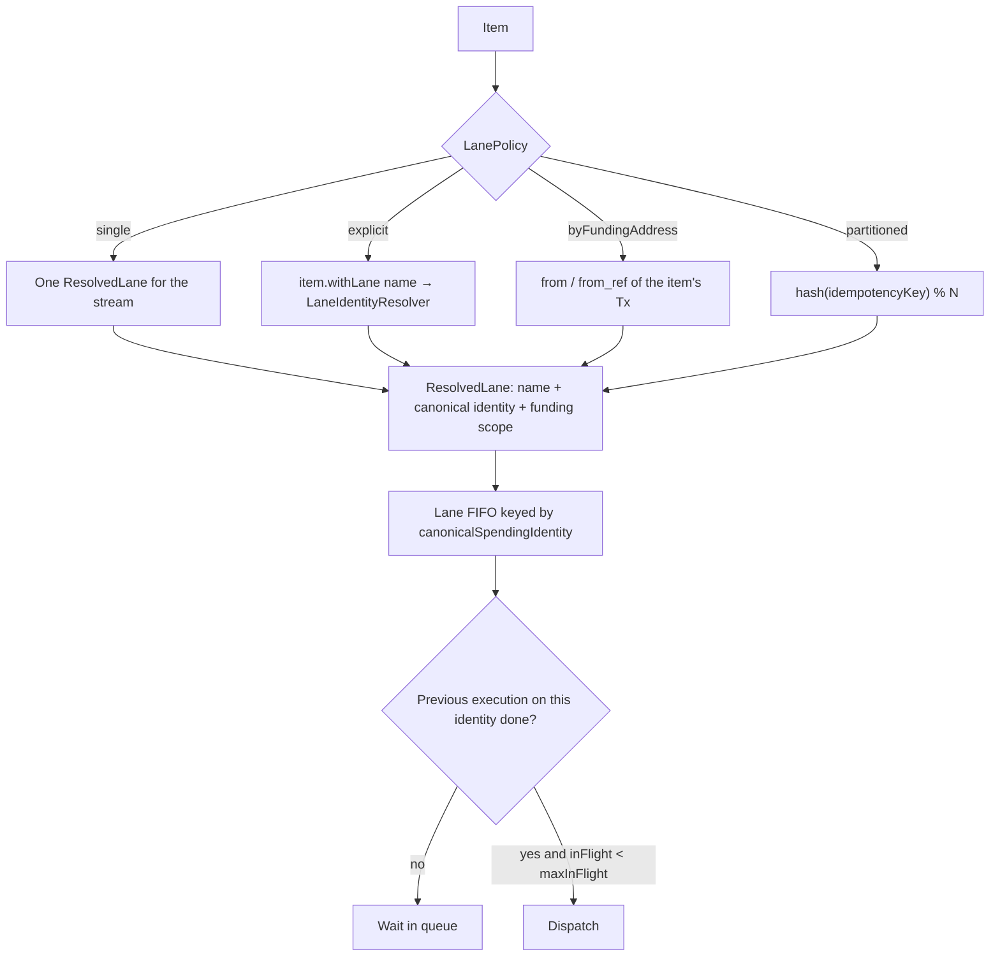

**Why per-identity FIFO, not a thread pool.** `FlowEngine` consumes the idempotency claim *before* acquiring spending resources. Letting two executions pile into `TXFLOW_RESOURCE_BUSY` would poison their claims. Per-lane dispatch makes that path unreachable in-process. (Cross-process lane sharing still needs engine P3, which has not landed; until then one writer per lane set.)

**Alias sharing.** Two labels resolving to the same wallet share one FIFO. Two lanes whose funding scopes overlap while claiming different identities fail typed `TXSTREAM_LANE_SCOPE_OVERLAP`.

**Mechanical coin selection.** Declaring a spending resource is not enough — QuickTx could still pick any wallet UTXO. The stream pins each planned transaction to the lane's address or funding ref (`enforceLaneFundingScope`). A violation fails the item typed `TXSTREAM_LANE_SCOPE_VIOLATION`.

**Fairness.** Ready lanes are scheduled round-robin under a global `maxInFlight` cap so one lane's backlog cannot starve the others. Each claimed execution is submitted as its own task on the caller-owned executor, so a multi-threaded executor lets different identities dispatch concurrently.

**Lane modes in one table**

| Policy | How the lane is chosen | Resolver | Bootstrap |
|---|---|---|---|
| `single(ResolvedLane)` | whole stream | none (validated at `build()`) | no |
| `explicit()` | `item.withLane(...)` required | **required** | no |
| `byFundingAddress()` | item's `from` / `from_ref` | none | no |
| `partitioned(PartitionedLanes)` | `hash(key) % N` | none (addresses supplied) | optional, default on |

Template items cannot derive a lane from a single transaction: under `byFundingAddress()` / `partitioned()` they fail `TXSTREAM_LANE_REQUIRED`. Use `single()` or `explicit()`.

---

## 9. Dispatch and two-phase binding

Deterministic execution id: `executionId = stableId(namespace, claimKey)` with namespace `stream:<streamId>`. Same claim → same execution id on every process, every redelivery. That is what makes write-ahead binding agree with `MATCHED`.

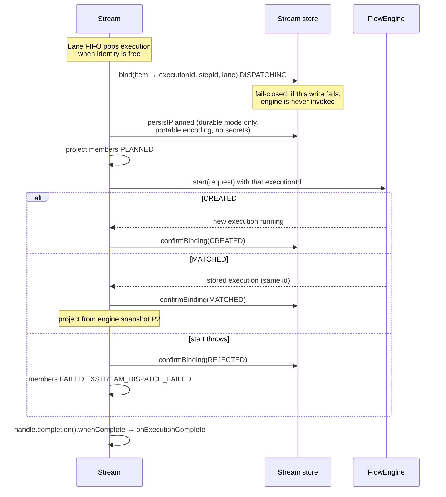

**Crash between bind and start.** Durable: restart sees a `DISPATCHING` binding. Engine snapshot present → start happened, confirm and re-project. Snapshot absent → start never happened, re-dispatch from the persisted plan under the same id. Non-durable: the item is lost like any buffered work; idempotent redelivery is the answer.

**No-secrets rule.** Persisted plans contain the portable-encoded definition, non-sensitive bindings, and secure-binding *references* + fingerprints — never resolved secrets or signer material. An item with inline `sensitiveBindings` fails `TXSTREAM_NON_PERSISTABLE_SECRET` at bind time in durable mode.

**Unobservable execution.** If `start()` succeeds but the completion observer cannot be registered, members settle `RECOVERY_REQUIRED` (`TXSTREAM_EXECUTION_UNOBSERVABLE`), the lane is **left busy** (the execution still occupies the spending identity), and the stream is marked unhealthy. Failing the items or freeing the lane would be dishonest / funds-unsafe.

---

## 10. Status is a projection of engine truth

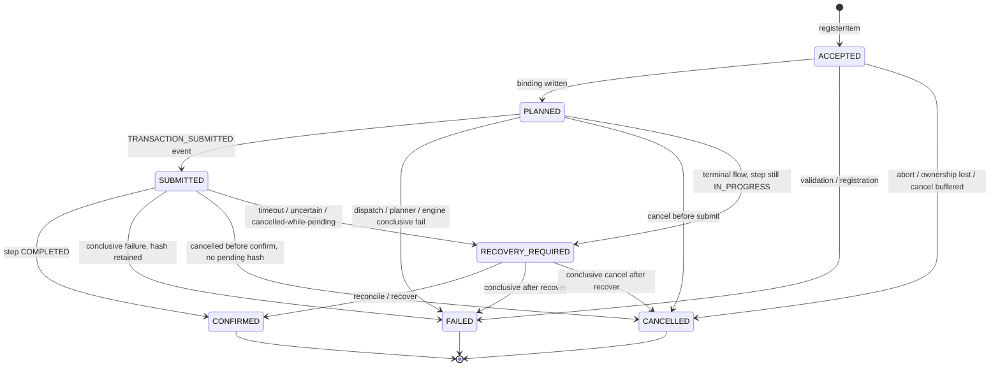

**Live vs authoritative**

- Live (event-driven) projections follow the table above, ordered by engine event sequence / store revision. A stale-sequence write is dropped — that is what kills CONFIRMED→FAILED overwrites.
- Authoritative (restart re-attach, compaction re-baseline, read-through reconcile) may **fast-forward** any non-final status to the snapshot-derived state. Final statuses (`CONFIRMED` / `FAILED` / `CANCELLED`) remain immutable.
- `SUBMITTED` is **never** asserted before the backend. Hash, once known, is never dropped. Latest submitted attempt wins.

**`RECOVERY_REQUIRED` is the honest "I don't know"**

Settles the receipt promise (so `drain()` / `close()` can return) but is **not final**. `getItemStatus` / `reconcile` re-read the engine snapshot and may advance to `CONFIRMED` / `FAILED` / `CANCELLED`. The completed `CompletionStage` is a *point-in-time* answer; the live projection can still move.

Litmus test for any new failure path: *can I prove the transaction is not, and will never be, on chain?* If not, it is uncertain — settle pending, project `RECOVERY_REQUIRED`, retain the hash. Never `FAILED`.

**Per-member mapping (`memberTerminalStatus`)**

| Evidence | Projected status |
|---|---|
| Step `IN_PROGRESS` (hash known, outcome unknown) | `RECOVERY_REQUIRED` — checked **first**, beats everything |
| Flow `ROLLED_BACK` | `FAILED` |
| Step `COMPLETED` / `FAILED` / `CANCELLED` | matching item status |
| No step result, flow `COMPLETED` | `CONFIRMED` (MATCHED stored flow with compacted steps) |
| No step result, flow `FAILED` | `FAILED` — engine guarantee: no step of a FAILED flow confirmed |
| Shared member, flow `PARTIALLY_COMPLETED`, no step result | member's own snapshot attempt evidence, else `RECOVERY_REQUIRED` (never a guess that could contradict a confirmed tx) |
| Flow `RECOVERY_REQUIRED` | `RECOVERY_REQUIRED` |

Template items project from the **whole flow**. `PARTIALLY_COMPLETED` → `RECOVERY_REQUIRED`. A `CANCELLED` template with any submitted-but-undecided attempt also → `RECOVERY_REQUIRED`.

---

## 11. Exactly-once: four layered guards

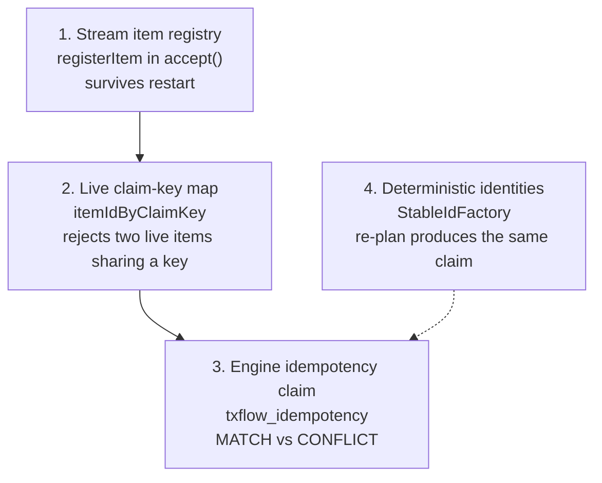

Each guard closes a different window. Guard 3 is the last line of defense: even if the stream re-plans after a crash, `FlowEngine.start` with the same identity and fingerprint MATCHes instead of re-running.

**After a `CANCELLED` settlement** the item id is consumed. Recover the work with a **new item id and the original idempotency key** so the engine claim still deduplicates. Use `trySubmit` when reconciling batches so conflicts report as `EmitResult` instead of throwing.

**Guard window vs eviction.** Duplicate detection and claim-key reuse hold only while the item is in the live map. Default `maxRetainedSettledItems = 10_000`. Unsettled items (including `RECOVERY_REQUIRED`) are never evicted. In-memory stores delete on eviction; durable stores treat `evictItem` as a no-op so `getItemStatus` can still read the row. See §16 for the remaining attach-after-eviction gap on durable streams.

---

## 12. Durability and restart

**Authority is split.** The engine store owns execution truth (outcomes, attempts, events, claims). The stream store owns planning metadata the engine never sees (item registry, item→execution/step/lane binding, planned records, bootstrap fingerprint, ownership lease). Projections are denormalized views: on disagreement the engine wins.

**Builder invariant.** A durable `TxStreamStateStore` requires `engine.capabilities().durableExecution()`. Pairing a durable stream store with an in-memory engine would re-dispatch executions that already ran — a transaction duplicator.

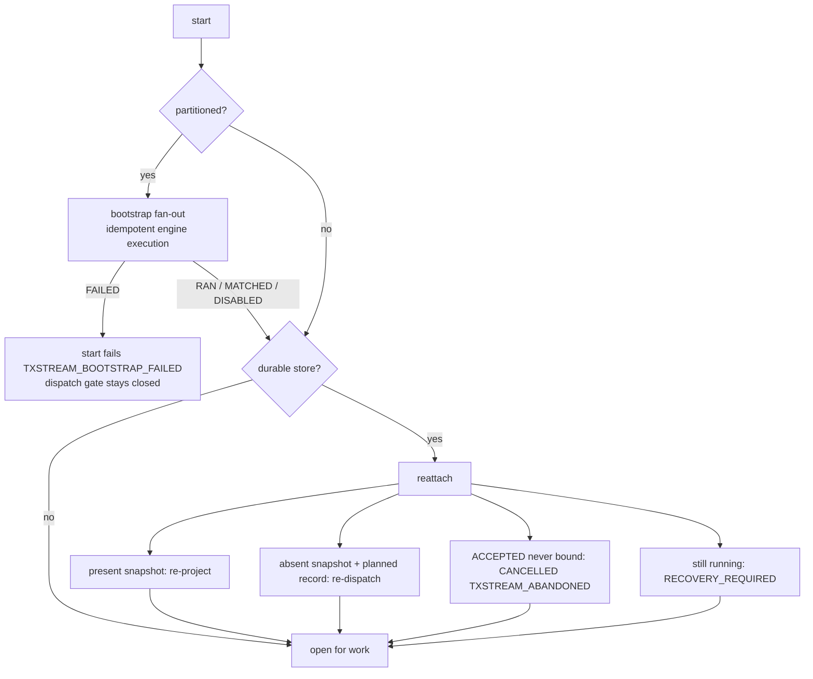

`start()` runs bootstrap (if partitioned) **before** reattach **before** opening for new work, so items never dispatch against unfunded lanes and re-dispatched executions actually run.

Calling `reattach()` before `start()` still recovers: present executions re-project, abandoned rows are reaped, re-dispatched work is queued and waits for `start()` to enable the dispatcher.

**Abandoned ghosts.** Items registered `ACCEPTED` but never bound have no planned record and never reached the engine. Left untouched they would grow `listNonTerminalItemIds` without bound. They are settled `CANCELLED` / `TXSTREAM_ABANDONED`. Redeliver them.

---

## 13. Partitioned lanes and bootstrap

Full UTXO throughput: N application-owned lane addresses, items assigned by `hash(idempotencyKey) % N`, optional one-time fan-out that pays `seedPerLane` to each address from one funding source.

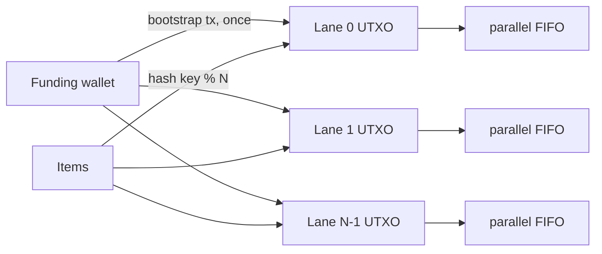

**The stream never manages keys.** The caller owns every lane address and the seed amount.

**Configuration stability is funds-critical.** Funding source, seed, N, and the **lane-address list including its order** form the bootstrap claim. Changing any of them mints a new split that re-drains the funding wallet; reordering remaps every item. A **durable** stream persists the fingerprint and fails `start()` typed `TXSTREAM_BOOTSTRAP_CONFIG_DRIFT` before submitting a split. A **non-durable** stream cannot detect drift.

**Dispatch gate.** No partitioned execution — including re-attach re-dispatch — runs until bootstrap has funded the lanes (`bootstrapSatisfied`). A failed bootstrap leaves the gate closed so `drain()` / `close()` do not dispatch onto empty lanes.

**Mid-flight bootstrap crash.** If the split was submitted but not confirmed, the next `start()` sees a non-terminal bootstrap and fails `BootstrapReport`. Reconcile the bootstrap execution (`engine.recover(...)`) before the stream can open.

With ownership enabled, **every instance** runs the idempotent bootstrap at `start()`, including standbys. They `MATCH` the owner's split; they never re-drain the wallet.

---

## 14. Ownership: active / standby HA

Opt-in (`ownership(ownerToken, leaseDuration)`). Requires a durable stream store that `supportsOwnership()`, a durable engine store, and a `maintenanceExecutor`.

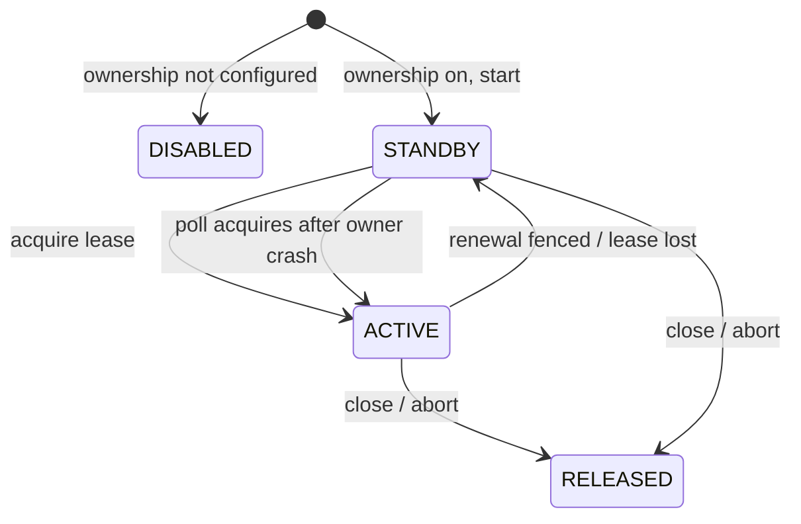

- Exactly one `ACTIVE` owner per `streamId` at a time. Only the current epoch-holder dispatches.
- Standbys poll; on expiry they acquire, re-attach, and resume durable non-terminal items.
- A stale owner whose renewal is fenced **steps down immediately**. In-flight engine executions it already started continue (the new owner reconciles them). Queued-but-unstarted work is `CANCELLED` / `TXSTREAM_OWNERSHIP_LOST`. Recover that work with a **new item id**.
- After step-down and pump quiescence, **no unsettled non-in-flight item exists anywhere** (window, planning queue, lane queue). Enqueue sites re-check ownership after enqueue and settle stragglers themselves.
- A standby is **paused, not closed.** `trySubmit` → `PAUSED` (adapters park). `submit` → `TXSTREAM_CLOSED`. The Flow adapter does not tear down. The reconciliation observer keeps running read-only (CAS-arbitrated store writes).
- Active/active lane-partitioned ownership is a **future extension** (needs engine P3 and per-lane leases).

---

## 15. Templates

A stream of parameterized invocations of one compiled flow.

1. `Builder.template(id, definition)` — compiled, validated, fingerprinted, portable-encoded **once** at `build()`. A non-portable definition fails at build, not per item.
2. Items: `TxWorkItem.builder(itemId).withTemplate(id).withBinding(...)`.
3. Dispatch bypasses windowing/planner: one whole-flow single-member execution per item, still claim-derived, still lane-FIFO.
4. Durable restart re-resolves the template by id. Re-registering a **different** definition under the same id fails the re-attached item `TXSTREAM_TEMPLATE_DRIFT` rather than running the wrong flow.
5. The definition is held **by reference**. Do not mutate it after `build()`.

---

## 16. Sources, backpressure, threading

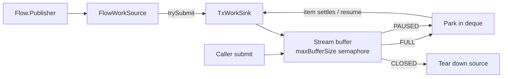

- `submit()` blocks on the capacity semaphore. `trySubmit()` does not.
- `FlowWorkSource` requests a bounded prefetch (default 64), never `Long.MAX_VALUE`. `accepted + held + outstandingDemand == prefetch`.
- `FULL` and `PAUSED` park the item; only `CLOSED` tears the source down.
- Mixing the adapter with direct `submit` calls that fill the buffer can stall held items — documented limitation of a thin bridge.
- Publisher `onError` → `terminated()` exceptionally `TXSTREAM_SOURCE_FAILED`. `onComplete` does **not** close the stream.
- **No owned threads.** Window timers, reconciliation, and ownership ticks run on the caller-owned `maintenanceExecutor`. Dispatch tasks run on the caller-owned `executor`. Blocking inside `onItemUpdated` stalls that lane's dispatch thread; the item promise is completed *before* the listener so `drain()` still unblocks.

---

## 17. Lifecycle

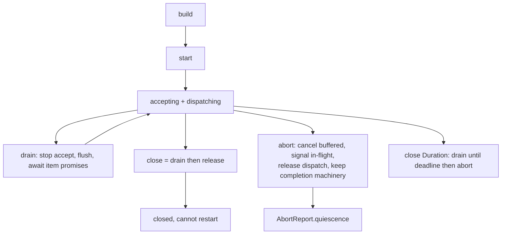

| Call | Accept new work | In-flight | Buffered | Returns when |
|---|---|---|---|---|
| `start()` | yes (after bootstrap + reattach) | runs | — | immediately; idempotent |
| `flush()` | still yes | — | planned now | immediately; no-op if closed |
| `drain()` | no | run to completion | planned | every accepted item promise settles (including `RECOVERY_REQUIRED`) |
| `close()` | no | run to completion | planned | drain + release; idempotent |
| `close(grace)` | no | signalled at deadline | cancelled at abort | deadline; does **not** promise execution termination |
| `abort(reason)` | no | cooperative `requestCancel` | `CANCELLED` immediately | immediately + `AbortReport.quiescence()` for full stop |

`drain()` is interruptible (`TXSTREAM_INTERRUPTED`). `awaitDrain(timeout)` throws `TxStreamTimeoutException`.

**Health.** `isHealthy()` is about the dispatcher, not lifecycle. A systemic dispatch failure marks the stream unhealthy and fails pending items typed; in-flight executions still deliver. A gracefully closed or aborted stream remains healthy.

**Cancel**

| Situation | `cancelItem` |
|---|---|
| Buffered / not yet dispatched | `CANCELLED_BUFFERED` immediately, never reaches the engine |
| Sole member of an in-flight execution | `SIGNALLED_SINGLE` — cooperative engine cancel; settles from engine outcome |
| Member of a shared multi-item flow | `REJECTED_SHARED` — names `executionId` + full member set. Escalate with `cancelExecution` |
| Unknown / already settled | `UNKNOWN_OR_SETTLED` |

Boolean `cancel(...)` returns `true` only for `CANCELLED_BUFFERED` and `SIGNALLED_SINGLE`. `false` is easy to misread as "already done" when the real answer is `REJECTED_SHARED`.

A submitted-then-cancelled item still projects `RECOVERY_REQUIRED` if the step is `IN_PROGRESS` with a hash — cancellation of the wait proves nothing about whether the transaction will land.

---

## 18. Stores

| Implementation | Durable | Ownership leases | Eviction | Use |
|---|---|---|---|---|
| `TxStreamStateStore.inMemory()` | no | no | deletes | tests, single process, crash loses unbound items |
| `TxStreamStateStore.inMemoryDurable()` | yes (process lifetime) | yes | **no-op** | tests of durable semantics |
| `RdbmsTxStreamStateStore` | yes (H2 / PostgreSQL) | yes | **no-op** | production |

RDBMS tables (alongside engine tables): `txstream_item`, `txstream_binding`, `txstream_planned`, `txstream_batch`, `txstream_bootstrap`, `txstream_ownership`.

---

## 19. Edge-case catalog

This is the operational contract. Several items are *designed* behaviour that still double-pays if the caller ignores them.

### Funds-critical

| Situation | What happens | What to do |
|---|---|---|
| `batching()` + source redelivers a *subset* of a previous batch | New member set → new claim → **second on-chain payment** | Use `perItem()`, or dedup upstream. Do not treat batching as per-item exactly-once. |
| Partitioned config change (N, seed, funding, **address order**) on a **non-durable** stream | Silent re-split of the funding wallet | Keep config byte-stable, or use a durable store (fail-fast `TXSTREAM_BOOTSTRAP_CONFIG_DRIFT`). |
| Same change on a durable stream | `start()` fails typed before any split | Fix config to match the persisted fingerprint. |
| `join()` on `RECOVERY_REQUIRED` then retry with a new item id | The original tx may still confirm → double pay | Reconcile the **hash** on chain. Only rebuild when the tx can no longer land. |
| Mutate a `TxPlan` / template `TxFlow` after submit / build | Fingerprint and executed content diverge; redelivery/claim behaviour is undefined | Treat submitted payloads as frozen. |
| Two processes spending one wallet **without** stream ownership | Engine claim can be consumed by `TXFLOW_RESOURCE_BUSY` (P3 not landed) | One writer per lane set, or opt into stream ownership on one `streamId`. |

### Redelivery and identity

| Situation | What happens |
|---|---|
| Same `itemId` + same fingerprint, item still live | Attach; existing receipt; no new work |
| Same `itemId` + different content | `TXSTREAM_DUPLICATE_ITEM` / `EmitResult.CONFLICT` |
| Same idempotency key, **different** `itemId`, original still live | `TXSTREAM_IDEMPOTENCY_KEY_REUSE` |
| Same key, different `itemId`, original `CANCELLED` | Allowed; engine claim still matches |
| `TXSTREAM_LANE_UNRESOLVED` | Failed and **not retained**; redelivery retries once the resolver recovers |
| Other content lane errors (`LANE_REQUIRED` / `MISMATCH` / `SCOPE_*`) | Failed and **retained**; redelivery attaches to that failure |
| Ownership lost on queued work | `CANCELLED` / `TXSTREAM_OWNERSHIP_LOST`; **new item id** to recover |
| Crash before bind (durable) | `TXSTREAM_ABANDONED`; redeliver |
| Crash after bind, start never happened (durable) | Re-dispatch from persisted plan |
| Crash after start | Re-project from engine snapshot |

### Durable live-map eviction (known gap)

After `maxRetainedSettledItems` (default 10k) the live map and claim-key index drop the item. Durable stores keep the row (`evictItem` is a no-op). `getItemStatus` can still read the store, but `accept()` only attach-or-conflicts against the live map, so a later `registerItem` of the same id is a **CONFLICT** even for identical content. In-memory eviction behaves as documented (fresh accept → engine `MATCH`). See [TXSTREAM_READINESS_REPORT.md](TXSTREAM_READINESS_REPORT.md) §4.1. Size the cap to cover the redelivery horizon, or wait for the store-lookup fix.

`reconcile(itemId)` returns empty when the item is not in the live map, even if the durable store still has a `RECOVERY_REQUIRED` row. `getItemStatus` in that case returns the stored snapshot **without** repairing it.

### Lifecycle and concurrency

| Situation | What happens |
|---|---|
| Accept racing `abort` / `close` / ownership fence | `rescueWindowStraggler` / post-enqueue ownership rescue settle the item; `drain()` does not hang |
| Planner running while ownership fence fires | Entry check + post-enqueue rescue settle `TXSTREAM_OWNERSHIP_LOST` (composition probe 1) |
| `abort()` from inside a listener | Reentrancy-safe; same `AbortReport` |
| Completion observer registration fails | Members `RECOVERY_REQUIRED`; lane stays busy; stream unhealthy |
| Blocking listener | Stalls that lane's dispatch thread; item promise already complete |
| `submit` on STANDBY | Throws `TXSTREAM_CLOSED` |
| `trySubmit` on STANDBY | `PAUSED` — park and retry, do not tear down |
| Shared-flow `cancelItem` | `REJECTED_SHARED`; not silently widened |
| Cancel during confirmation | Step pending + hash → item `RECOVERY_REQUIRED`, not `CANCELLED` |
| Count-only window > buffer | Rejected at `build()` |
| Durable stream store + in-memory engine | Rejected at `build()` |
| Ownership store without `supportsOwnership()` | Rejected at `build()` (would otherwise stay STANDBY forever) |
| `confirmedCount > acceptedCount` after re-attach | Legitimate: re-attached confirmed items seed counters from store |

### Templates and planning

| Situation | What happens |
|---|---|
| Unknown template id | `TXSTREAM_TEMPLATE_UNKNOWN` at submit; retained |
| Template definition changed across restart | `TXSTREAM_TEMPLATE_DRIFT` on re-attach |
| Template + `byFundingAddress` / `partitioned` | `TXSTREAM_LANE_REQUIRED` |
| Custom planner maps one item twice | `TXSTREAM_PLAN_INVALID` |
| Custom planner maps items from two lanes into one flow | `TXSTREAM_PLAN_CROSS_LANE` |
| Custom planner omits an item | that item `TXSTREAM_PLAN_OMITTED`; rest proceeds |
| Custom planner shares a step but the tx does not pay every member | Stream **cannot detect this**; items report `CONFIRMED` with that hash. Built-in batching does not have this hole. |

---

## 20. Error-code map

Codes are string literals on `TxStreamException` (no public constants class yet). Grouped by phase.

**Acceptance / content**

| Code | Meaning |
|---|---|
| `TXSTREAM_INVALID_ITEM` | Item content violates policy (blank ids, store text policy, …) |
| `TXSTREAM_NON_PORTABLE_ITEM` | Payload cannot be compiled by the engine |
| `TXSTREAM_DUPLICATE_ITEM` | Same item id, different fingerprint |
| `TXSTREAM_IDEMPOTENCY_KEY_REUSE` | Key already bound to a different live item id |
| `TXSTREAM_REGISTRATION_FAILED` | Authoritative `registerItem` failed |
| `TXSTREAM_TEMPLATE_UNKNOWN` | Item references an unregistered template |
| `TXSTREAM_LANE_REQUIRED` | Explicit/template policy needs a lane name |
| `TXSTREAM_LANE_MISMATCH` | Named lane ≠ configured / derived lane |
| `TXSTREAM_LANE_UNRESOLVED` | Resolver failed or returned null (not retained) |
| `TXSTREAM_LANE_UNDERIVABLE` | No single `from` / `from_ref` to derive a lane |
| `TXSTREAM_LANE_SCOPE_OVERLAP` | Two identities claim overlapping funding scopes |
| `TXSTREAM_LANE_SCOPE_VIOLATION` | Transaction draws outside the lane's funding scope |

**Planning / dispatch**

| Code | Meaning |
|---|---|
| `TXSTREAM_PLANNER_FAILED` | Planner threw or returned null |
| `TXSTREAM_PLAN_INVALID` | Duplicate mappings, orphan steps, bad claim key |
| `TXSTREAM_PLAN_CROSS_LANE` | One planned flow spans lanes |
| `TXSTREAM_PLAN_OMITTED` | Planner dropped an accepted item |
| `TXSTREAM_BATCH_INELIGIBLE_ITEM` | Non-payment item with reject-mode batching |
| `TXSTREAM_BINDING_FAILED` | Write-ahead bind failed (fail-closed, no start) |
| `TXSTREAM_NON_PERSISTABLE_SECRET` | Inline sensitive binding in durable mode |
| `TXSTREAM_PLANNED_ENCODE_FAILED` / `_WRITE_FAILED` | Durable planned-record persistence |
| `TXSTREAM_DISPATCH_FAILED` | Engine `start` failed or unexpected pre-start error |
| `TXSTREAM_EXECUTION_UNOBSERVABLE` | Start succeeded; observer could not be registered |
| `TXSTREAM_EXECUTION_FAILED` | Engine completion path itself broke |
| `TXSTREAM_PROJECTION_FAILED` | Terminal projection threw for one member |

**Lifecycle / HA / recovery**

| Code | Meaning |
|---|---|
| `TXSTREAM_CLOSED` | Not accepting (including blocking submit on STANDBY) |
| `TXSTREAM_ABORTED` | Stream abort cancelled this item |
| `TXSTREAM_UNHEALTHY` | Dispatcher died before the item could run |
| `TXSTREAM_INTERRUPTED` | Thread interrupted in `submit` / `drain` |
| `TXSTREAM_TIMEOUT` | `awaitDrain` deadline |
| `TXSTREAM_DRAIN_FAILED` | Unexpected drain failure |
| `TXSTREAM_ITEM_CANCELLED` / `TXSTREAM_EXECUTION_CANCELLED` | Caller cancel |
| `TXSTREAM_OWNERSHIP_FENCED` | Lease renewal lost |
| `TXSTREAM_OWNERSHIP_LOST` | Queued work settled on step-down |
| `TXSTREAM_BOOTSTRAP_FAILED` / `_CONFIG_DRIFT` | Partitioned fan-out |
| `TXSTREAM_ABANDONED` | Accepted before crash, never bound |
| `TXSTREAM_REATTACH_*` | Reattach could not confirm / step missing |
| `TXSTREAM_TEMPLATE_DRIFT` | Re-registered template definition changed |
| `TXSTREAM_SOURCE_FAILED` | Work publisher `onError` |
| `TXSTREAM_SUBSCRIBER_OVERFLOW` | Downstream Flow subscriber |

Store-layer codes (`TXSTREAM_STORE_*`, `TXSTREAM_ITEM_UNKNOWN`, `TXSTREAM_BINDING_MISSING`) surface from SPI implementations.

---

## 21. Source map

| Path | Role |
|---|---|
| `stream/TxFlowStream.java` | Public interface + builder |
| `stream/EngineTxFlowStream.java` | Implementation (~5,146 lines) |
| `stream/BuiltInPlanners.java` | `perItem` / `perWindow` / `batching` |
| `stream/LanePolicy.java`, `ResolvedLane.java`, `PartitionedLanes.java` | Lane identity |
| `stream/WindowPolicy.java` | Count / time close rules |
| `stream/StableIdFactory.java`, `StreamIdentities.java` | Deterministic ids and fingerprints |
| `stream/TxStreamStateStore.java` + in-memory impls | Stream-side persistence SPI |
| `stream/FlowWorkSource.java` | `Flow.Publisher` adapter |
| `stream/ItemProjection.java` | Transition table + completion promise |
| `exec/FlowEngine.java` | Claims, leases, journal, recover |
| `txflow-extensions/txflow-store-rdbms` | JDBC store (H2 / PostgreSQL) |
| `txflow-extensions/txflow-soak` | Long-running chain-as-oracle soak |

---

## 22. Key decisions (as implemented)

1. **Execute through `FlowEngine`, not `FlowExecutor`.** The stream inherits claims, fencing, WAL, and typed recovery. Legacy runner knobs are gone.
2. **Lanes are the concurrency model.** Schedule on canonical spending identity; engine spending resources are the cross-process safety net.
3. **Item idempotency is engine idempotency, scoped per planner.** `perItem()` is per-item; multi-item planners are flow-level and say so loudly.
4. **Status is a projection of engine truth** with an explicit transition table, sequence ordering, and an authoritative fast-forward exemption.
5. **Split-authority stores, fail-closed planning writes.** Engine owns outcomes; stream owns item↔execution mapping. Projections and listeners are best-effort.
6. **Two-phase binding + deterministic execution ids.** `MATCHED` cannot diverge from the write-ahead record.
7. **Portable payloads only**, validated at `submit()`. Java transaction factories never reach the engine.
8. **Caller-owned threads and clocks.** Deterministic tests; no hidden pools.
9. **`close()` is graceful; `abort()` is forced but honest about cooperativeness.** Receipts settle from real engine outcomes after abort.
10. **Never report `FAILED` while a submitted transaction may still confirm.** `RECOVERY_REQUIRED` is the honest uncertain state.

---

## 23. Reading order

1. This document (§1–§4, then the subsystem you need).
2. Public getting-started if you are integrating.
3. [TXFLOW_ENGINE_INTERNALS.md](TXFLOW_ENGINE_INTERNALS.md) §7 for the uncertain-disposition contract the stream projects.
4. [TXSTREAM_INTERNALS.md](TXSTREAM_INTERNALS.md) before changing `EngineTxFlowStream`.
5. [TXSTREAM_READINESS_REPORT.md](TXSTREAM_READINESS_REPORT.md) for remaining API gaps.
6. ADR 0004 for the decision record and what was rejected.
